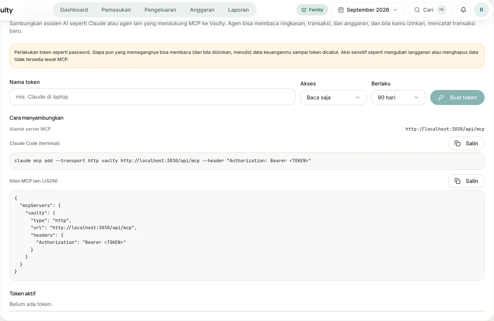

**MCP (Model Context Protocol)** adalah cara standar agar asisten AI terhubung ke layanan lain. Dengan MCP, asisten AI yang kamu pakai (misalnya Claude Code) bisa membaca ringkasan keuanganmu dan, kalau kamu izinkan, mencatat transaksi baru di Vaulty.

Tersedia untuk paket **Personal** ke atas.

## 1. Buat token akses

1. Buka **Pengaturan > Akses agen AI (MCP)**. Hanya pemilik organisasi yang bisa mengelola token.
2. Isi **nama token** (misalnya "Claude di laptop").
3. Pilih **akses**: *Baca saja*, atau *Baca dan catat transaksi*.
4. Pilih **masa berlaku**: 30 hari, 90 hari, 1 tahun, atau tanpa batas.
5. Klik **Buat token**, lalu **salin token sekarang**. Token hanya ditampilkan sekali.

:::danger[Perlakukan token seperti password]
Siapa pun yang memegang token bisa membaca (dan bila diizinkan, menulis) data keuanganmu sampai token dicabut. Kalau token bocor, cabut segera di halaman yang sama.
:::

## 2. Sambungkan ke agen

Alamat server MCP: `https://<alamat-aplikasi-vaulty>/api/mcp`. Halaman pengaturan menampilkan alamat yang benar beserta contoh siap salin.

### Claude Code

```bash
claude mcp add --transport http vaulty https://<alamat-aplikasi-vaulty>/api/mcp \
  --header "Authorization: Bearer <TOKEN>"
```

### Klien MCP lain (JSON)

```json
{
  "mcpServers": {
    "vaulty": {
      "type": "http",
      "url": "https://<alamat-aplikasi-vaulty>/api/mcp",
      "headers": { "Authorization": "Bearer <TOKEN>" }
    }
  }
}
```

## 3. Coba

Minta agenmu, misalnya:

- "Berapa total pengeluaranku bulan ini, dan kategori apa yang terbesar?"
- "Anggaran mana yang sudah terlampaui?"
- "Catat pengeluaran kopi Rp 25.000 kategori Makanan."

Untuk permintaan terakhir, token harus punya akses tulis. Agen akan memanggil daftar kategori dulu supaya kategori dan metode pembayaran sesuai.

## Batas dan keamanan

- Agen hanya bisa **menambah** transaksi. Tidak ada mengubah atau menghapus, dan tidak ada aksi sensitif seperti mengubah langganan atau mengundang anggota.
- Maksimal **60 permintaan per menit** per token dan **10 token aktif** per organisasi.
- Setiap panggilan diperiksa ulang: token belum dicabut atau kedaluwarsa, pembuatnya masih anggota organisasi, dan paketnya masih mencakup MCP.
- Semua pencatatan lewat MCP tercatat di log aktivitas dengan nama token.
- Menurunkan paket ke Gratis menutup akses MCP. Token tidak terhapus dan berfungsi lagi saat kamu naik paket.

Lihat [referensi tools](/agen-ai/referensi-tools/) untuk parameter tiap alat.

## Tampilan di aplikasi


