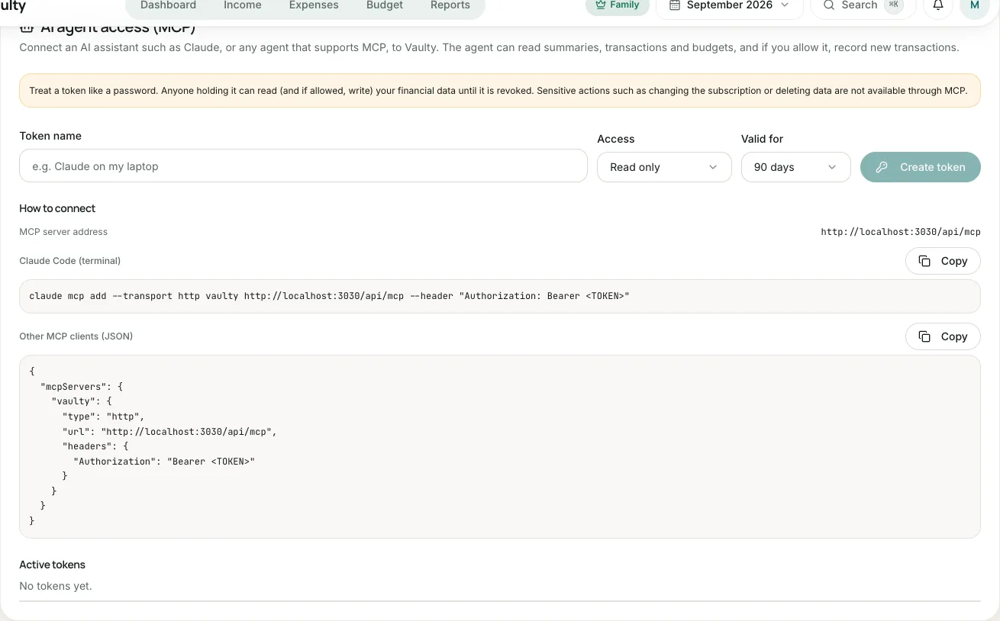

**MCP (Model Context Protocol)** is a standard way for AI assistants to connect to other services. With MCP, the assistant you use (for example Claude Code) can read your financial summary and, if you allow it, record new transactions in Vaulty.

Available on the **Personal** plan and above.

## 1. Create an access token

1. Open **Settings > AI agent access (MCP)**. Only the organization owner can manage tokens.
2. Enter a **token name** (for example "Claude on my laptop").
3. Choose the **access**: *Read only*, or *Read and record transactions*.
4. Choose the **validity**: 30 days, 90 days, 1 year, or no expiry.
5. Click **Create token**, then **copy the token now**. It is shown only once.

:::danger[Treat a token like a password]
Anyone holding the token can read (and if allowed, write) your financial data until it is revoked. If a token leaks, revoke it right away on the same page.
:::

## 2. Connect it to your agent

MCP server address: `https://<your-vaulty-app-address>/api/mcp`. The settings page shows the correct address with ready-to-copy examples.

### Claude Code

```bash
claude mcp add --transport http vaulty https://<your-vaulty-app-address>/api/mcp \
  --header "Authorization: Bearer <TOKEN>"
```

### Other MCP clients (JSON)

```json
{
  "mcpServers": {
    "vaulty": {
      "type": "http",
      "url": "https://<your-vaulty-app-address>/api/mcp",
      "headers": { "Authorization": "Bearer <TOKEN>" }
    }
  }
}
```

## 3. Try it

Ask your agent, for example:

- "What is my total spending this month, and which category is the largest?"
- "Which budgets have I gone over?"
- "Record a coffee expense of Rp 25,000 in the Food category."

For the last request the token needs write access. The agent will first fetch the category list so the category and payment method match.

## Limits and security

- The agent can only **add** transactions. There is no editing or deleting, and no sensitive actions such as changing the subscription or inviting members.
- At most **60 requests per minute** per token and **10 active tokens** per organization.
- Every call is checked again: the token is not revoked or expired, its creator is still a member of the organization, and the plan still includes MCP.
- Everything recorded through MCP is written to the activity log with the token name.
- Downgrading to Free closes MCP access. Tokens are not deleted and work again when you upgrade.

See the [tools reference](/en/agen-ai/referensi-tools/) for each tool's parameters.

## What it looks like in the app


