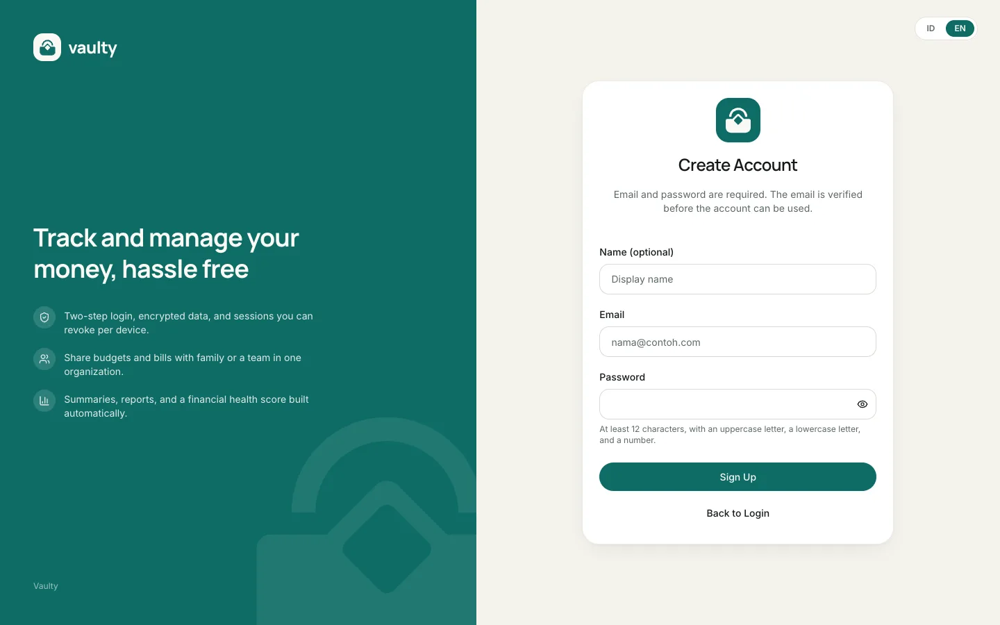
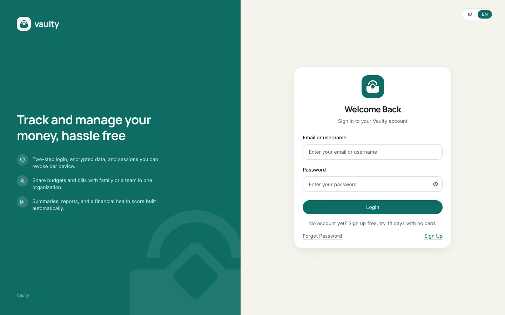

## Sign up

You can sign up two ways:

1. **Email and password.** The password needs at least 12 characters with an uppercase letter, a lowercase letter, and a number. After signing up we send a verification email. Click the link in it (valid for 24 hours) to activate your account.
2. **Continue with Google.** Your account is active right away with no verification email. If your Google email is already registered with a password, the accounts are linked instead of duplicated.

Every new account gets a **14-day trial** with no card. After verification (or when the Google account is created) you receive a welcome email.

:::note
All Vaulty emails go to the address registered on your account. If the verification email does not arrive, check your spam folder, then request a new one from the login page.
:::

## Log in

Log in with your email or username and password, or the Google button. If you turned on [two-step verification](#account-security), you are also asked for a code from your authenticator app.

## Forgot your password

Choose **Forgot Password** on the login page, enter your email, and follow the link we send (valid for 1 hour, single use). For safety, this page answers the same way whether or not the email is registered.

## Account security

In **Settings** you can:

- change your password (other devices are signed out),
- turn on **two-step verification** (Personal plan and above),
- see the devices currently signed in and sign them out.

## What the pages look like

