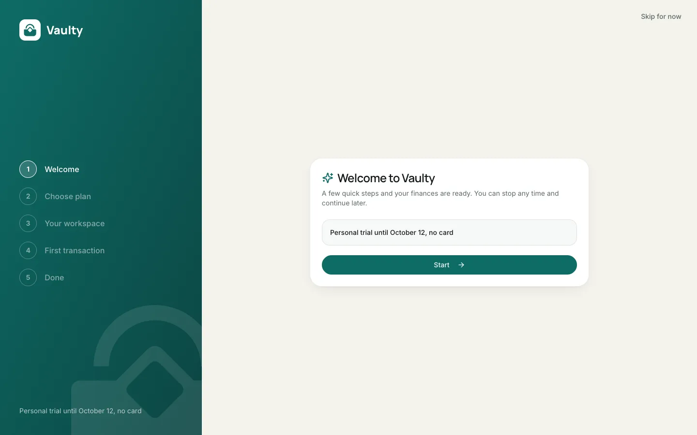
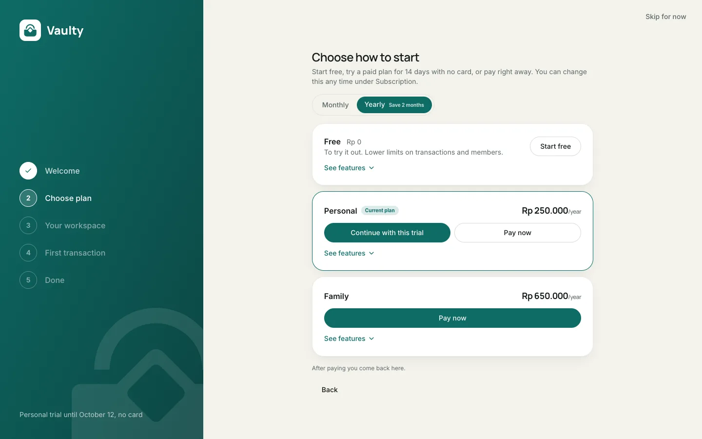
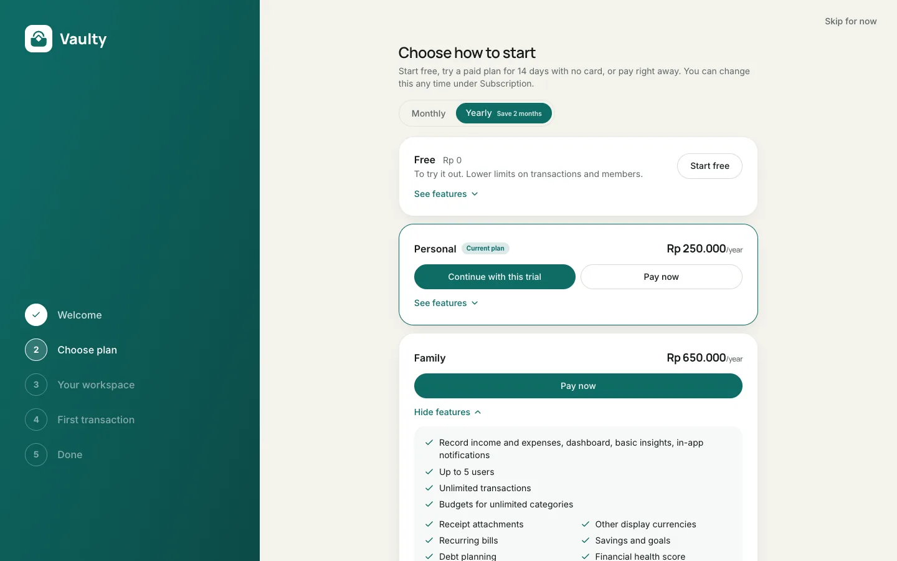
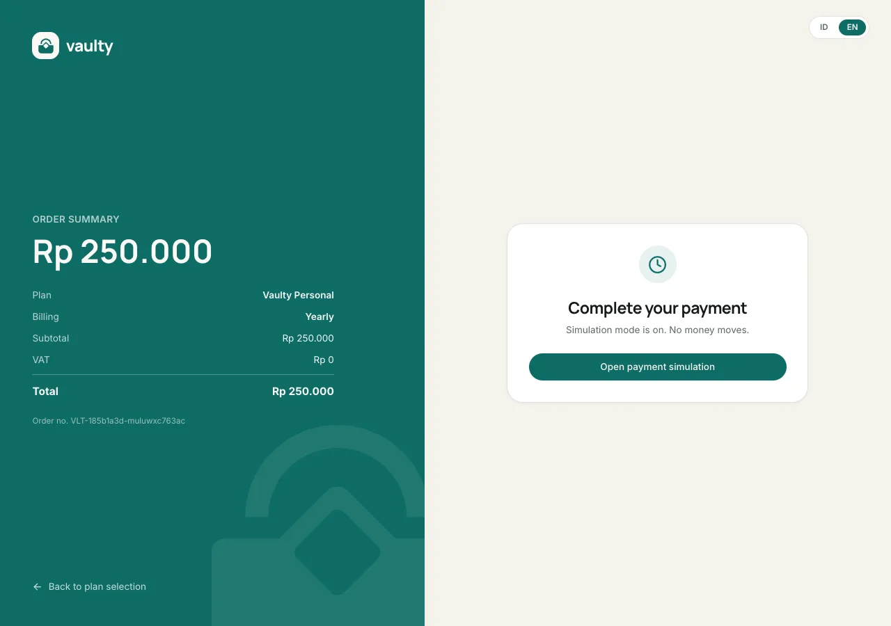
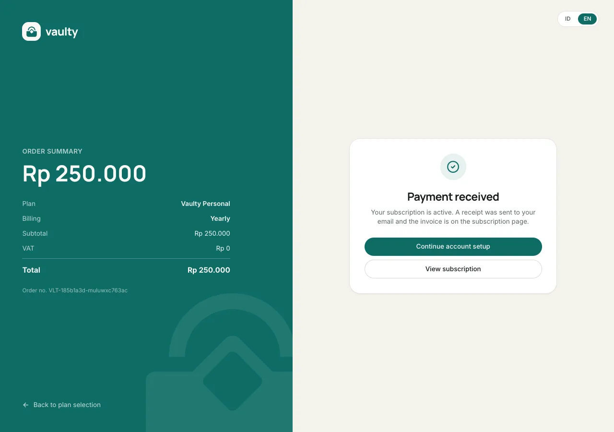
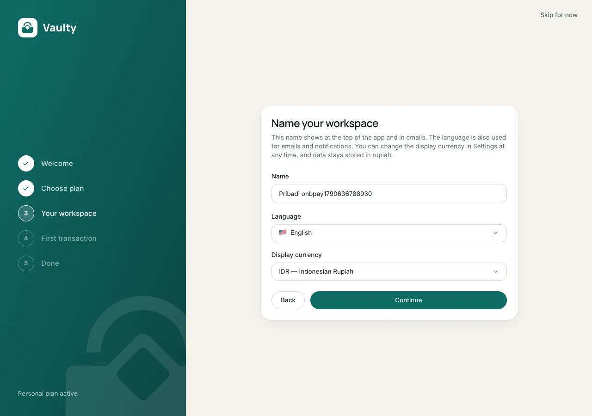
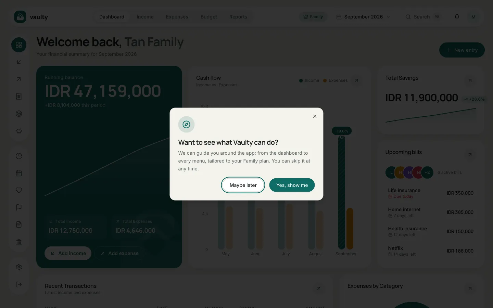
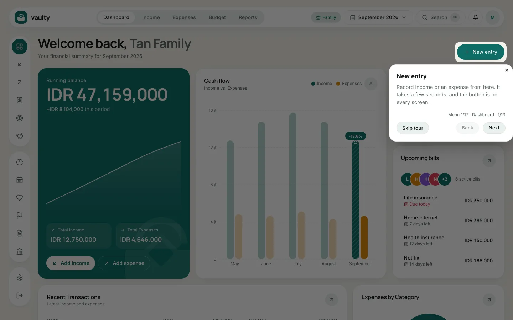

## Onboarding

The first time you sign in you go through five short steps:

1. **Welcome.**
2. **Choose a plan.** A 14-day Personal trial, the Free plan, or a paid plan right away. You can change it later.
3. **Workspace.** Workspace name, language, and display currency.
4. **First transaction.** Use sample data, or skip.
5. **Done.** A confirmation screen with a button to the dashboard.

Every step can be skipped with the button at the top right.

## Product tour

The first time you open the dashboard, Vaulty asks **"Want to see what Vaulty can do?"**.

- **Yes, show me:** the tour runs from the dashboard through each menu, explaining what the menu does, its add button, and how to read its list.
- **Maybe later:** you are told the tour can be started again any time.

The tour **fits your plan**: pages outside your plan are skipped, and at the end there is a summary of features on higher plans. A **Skip tour** button is on every step.

### Replay the tour

Open the account menu (the avatar at the top right on a computer, or the menu on a phone) and choose **Product tour**.

## What it looks like

Step 1, welcome:

Step 2, choose a plan. Click **See features** to open each plan's details:

Step 3, your workspace:

## If you pay right at step 2

Choosing **Pay now** on the "Choose plan" step opens the same payment page used by the Subscription menu in the dashboard: order summary on the left, embedded Midtrans payment options on the right.

Once the payment is received, the **Continue account setup** button takes you back into onboarding, right at the "Your workspace" step (not back to step 1).

### The tour question and its first step

