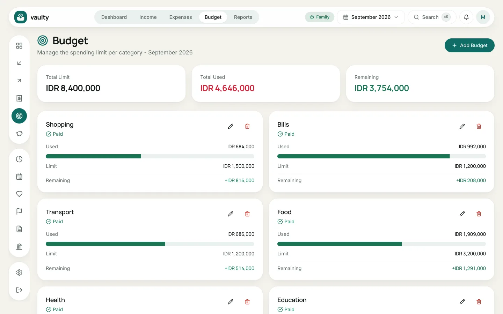
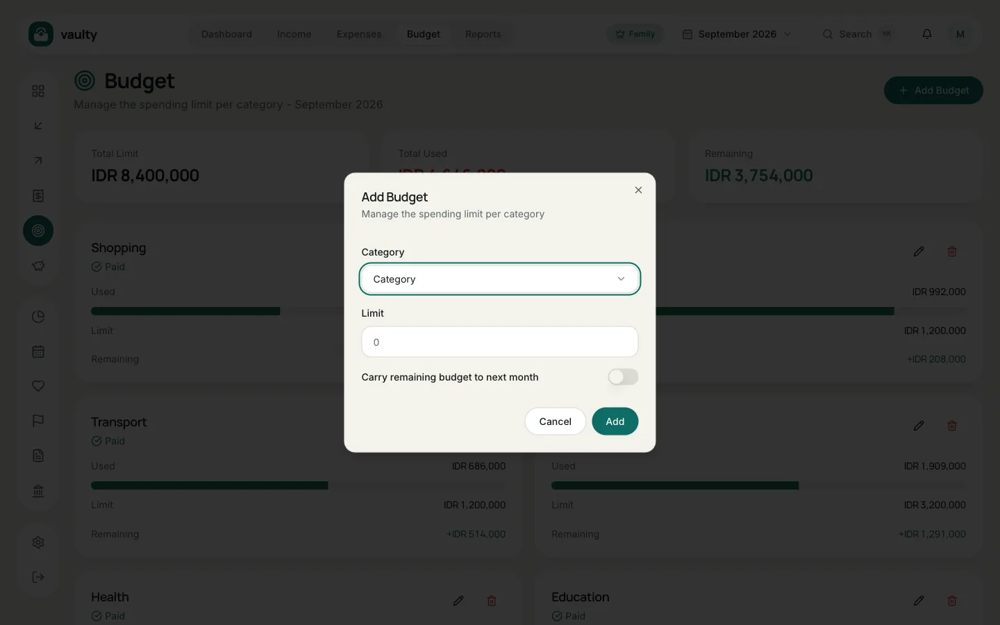

**Budget** helps you hold back spending per category each month.

## Creating a budget

1. Open **Budget** and pick the month in the picker at the top.
2. Click **Add Budget**.
3. Choose a **Category** and enter the **Limit** (the maximum for that month).
4. (Optional) Turn on **Carry remaining budget to next month** if leftover budget should roll over.
5. Click **Add**.

## Reading the cards

Each card shows **Spent**, **Limit**, and **Remaining**. The progress bar turns **red** and the remainder goes negative when spending passes the limit. Above the cards are the total limit, total spent, and total remaining for that month.

## Notes

- Free plan: at most **3 budget categories**.
- Budgets are per month. For a new month, add them again or use the rollover option.
- Notifications for a budget nearly used up arrive through the bell and (Personal plan and above) email. Set them up in [Planning](/en/panduan/perencanaan/).
