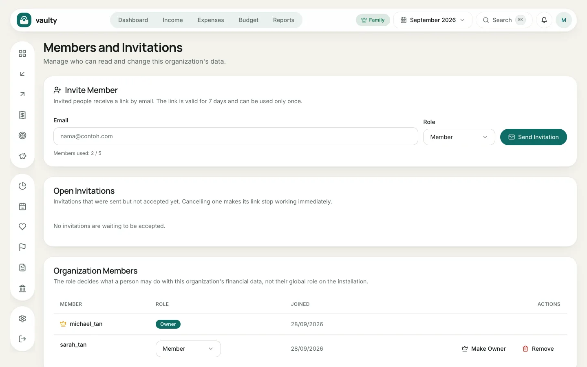

The **Family** plan lets up to **5 users** share one organization. Everyone sees the same data. Open it from the account menu and choose **Members**.

## Inviting a member

1. Enter the **Email** of the person you are inviting.
2. Choose a **Role**.
3. Click **Send Invitation**.

The person receives an email with a link that is **valid for 7 days and works only once**. Invitations not yet accepted show under **Open Invitations** and can be canceled (the link stops working right away). The counter below the form shows the quota, for example "2 / 5".

## Roles

| Role | Can |
|---|---|
| **Owner** | everything, including the subscription, AI agent access, and deleting the organization |
| **Admin** | record and change data, manage members, restore backups |
| **Member** | read, record, change, and delete financial data |
| **Viewer** | read only |

## Changing or removing a member

In the **Organization Members** table, change a role with the dropdown, or click **Remove** to take someone out. **Make Owner** transfers ownership of the organization to that member.

A removed member loses access right away, including any AI agent tokens they created.
