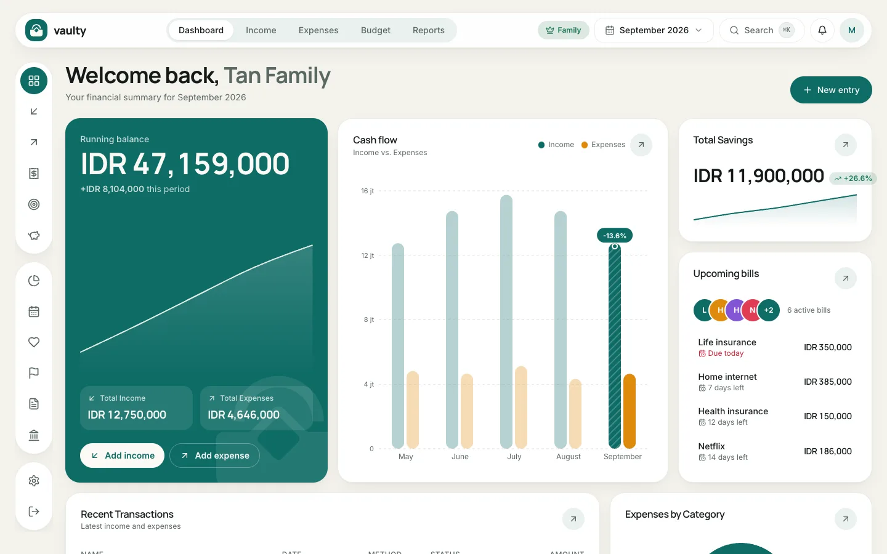

The dashboard is the first page after you sign in. It summarizes your finances for the selected month.

## What is on this page

- **Running balance:** income minus expenses for the selected period, with **Total Income** and **Total Expenses**.
- **Cash flow:** income and expense bars per month, to see the trend over recent months.
- **Total Savings:** the sum of all your savings and how it is growing.
- **Upcoming bills:** recurring bills about to fall due, nearest first.
- **Recent Transactions** and **Expenses by Category** further down.

## What you can do

1. **Change the period** with the month picker at the top (for example "September 2026"). Every card follows that month.
2. **Record quickly** with the **New entry** button at the top right, or the **Add income** and **Add expense** buttons on the balance card.
3. **Search** transactions with the **Search** box (or press `Ctrl` / `Cmd` + `K`).
4. Open the **bell** to see notifications, such as bills coming due or a budget nearly used up.
5. Click your **avatar** at the top right for the account menu: organization, members, master data, subscription, settings, and **Product tour**.

The badge next to the month picker (for example **Family**) shows your plan. Click it to open the subscription page.
