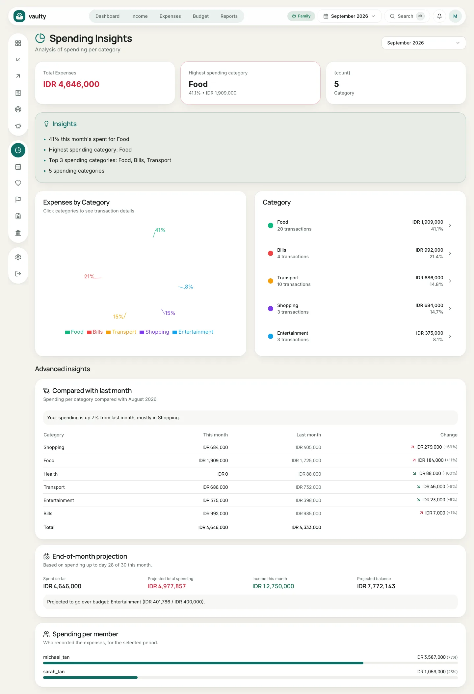
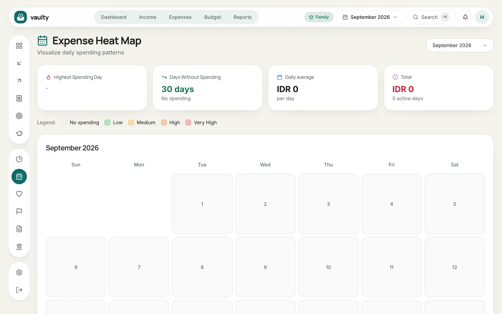
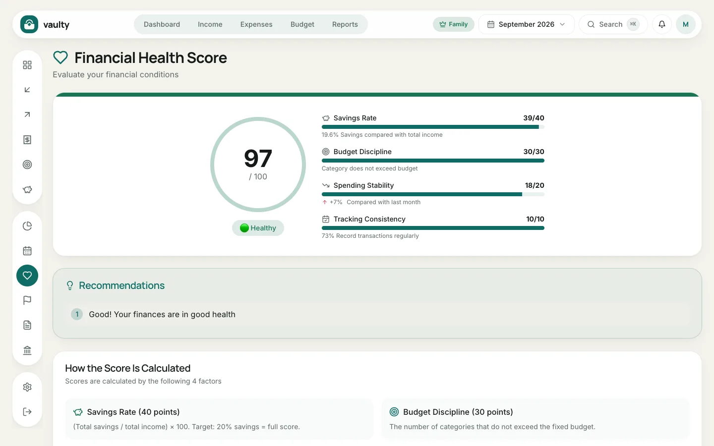

Three pages that help you read your data, not just record it.

## Spending Insights

This page shows your spending per category for the selected month: a pie chart, a ranking of categories, and a few automatic insight sentences. Click a category to see its transactions. Available on every plan.

### Advanced insights (Family plan)

At the bottom of the page, the Family plan adds three analyses:

1. **Compared with last month:** a per-category table (this month, last month, the change and its percentage) with a summary such as "your spending is up 40%, mostly in Food".
2. **End-of-month projection:** an estimate of total spending by month end based on the pace so far, compared with income, plus a list of budgeted categories projected to go over their limit. The projection only applies to the current month and appears after at least 5 days of data.
3. **Spending per member:** who recorded how much, useful for families.

Other plans see an upgrade hint here.

## Expense Heat Map (Personal and above)

The heat map shows **the days and times you spend the most**. A darker color means higher spending. It helps you spot habits, such as overspending on weekends.

## Financial Health Score (Personal and above)

A score from 0 to 100 built from four components:

| Component | Weight | What it measures |
|---|:---:|---|
| Savings Rate | 40 | savings compared with income (target 20%) |
| Budget Discipline | 30 | categories that stay within their budget |
| Spending Stability | 20 | how spending changed from last month |
| Tracking Consistency | 10 | how regularly you record transactions |

Below the score are **Recommendations** pointing to what to improve first.
