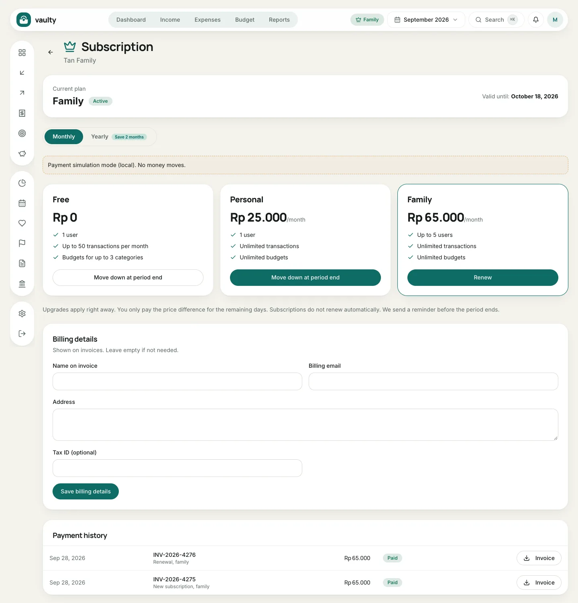

Open **Subscription** from the plan badge at the top or the account menu. Only the organization **owner** can pay and change plans.

## What is on the page

- **Current plan** and its valid-until date (or the trial end).
- A **Monthly** or **Yearly** switch (yearly = 10 months, 2 months free).
- Three plan cards: **Free**, **Personal**, and **Family**, with buttons that fit your situation.
- **Billing details** for invoices.
- **Payment history** with a download **Invoice** button.

## Paying or upgrading

1. Choose **Monthly** or **Yearly**.
2. Click **Pay now** (or **Upgrade** / **Renew**) on the plan you want.
3. On the payment page, choose how to pay and complete it. See [Payments and invoices](/en/paket/pembayaran-dan-invoice/).

Upgrades apply right away and you only pay the **price difference** for the rest of the period.

## Downgrading

Click the downgrade button on a lower plan. The change applies at the **end of the current period**, and you keep your current plan until then.

## Billing details and invoices

Fill in **Name on invoice**, **Billing email**, **Address**, and **Tax ID** (optional), then **Save billing details**. They appear on later invoices. Download the PDF invoice with the **Invoice** button in **Payment history**.
