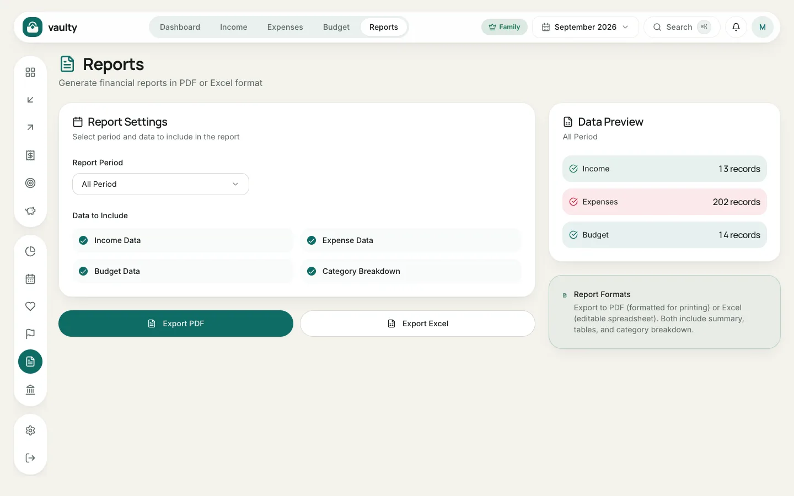

The **Reports** menu builds a document with a summary, tables, and a category breakdown. PDF and Excel export are on the **Personal** plan and above.

## Steps

1. Open **Reports**.
2. Choose the **Report Period**: a specific month or **All Periods**.
3. Under **Data to Include**, pick the parts you want: **Income Data**, **Expense Data**, **Budget Data**, and **Category Breakdown**.
4. Check the **Data Preview** on the right to make sure the number of records looks right.
5. Click **Export PDF** (print-ready) or **Export Excel** (editable).

The report language follows the language you use in the app: Indonesian or English, never mixed.

## When to use it

- Monthly or yearly records.
- Reviewing together with a partner or family.
- Material for tax filings or loan applications.
