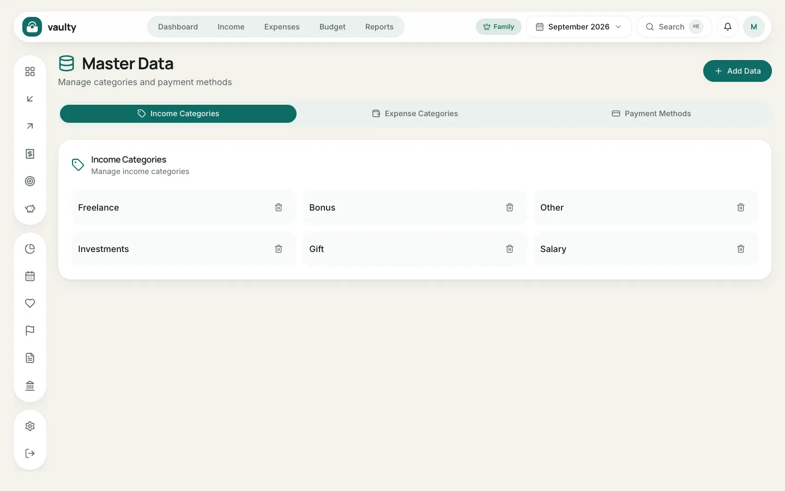
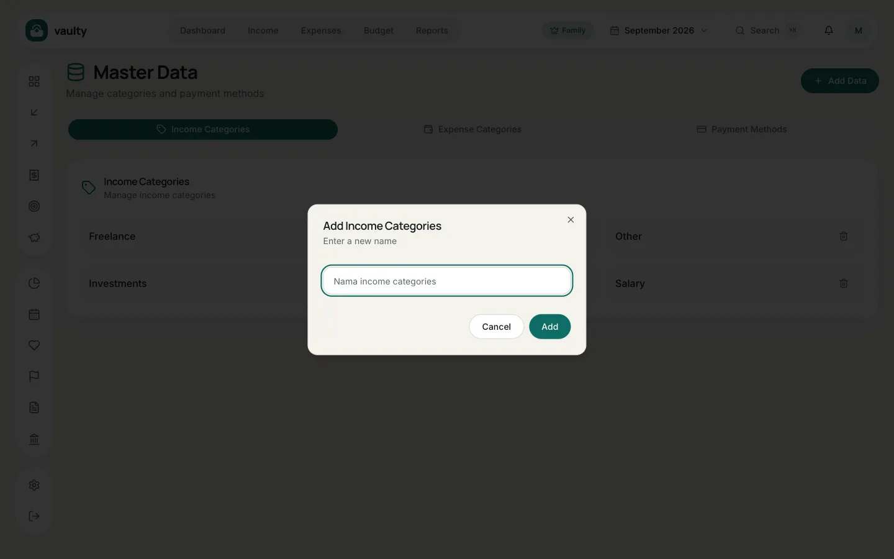

**Master data** is the list of choices that appear in forms: income categories, expense categories, and payment methods. Open it from the account menu (the avatar at the top right).

## Adding a choice

1. Pick a tab: **Income Categories**, **Expense Categories**, or **Payment Methods**.
2. Click **Add Data**.
3. Type the new name and save.

## Deleting

Click the trash icon next to a name. Older transactions that already use that name **do not change**, only the choice disappears from future forms.

## Notes

- The starting lists are created when you sign up, in the language you chose. They belong to you and do not change if you switch the app language.
- Use short, consistent names so insights and reports stay tidy.
