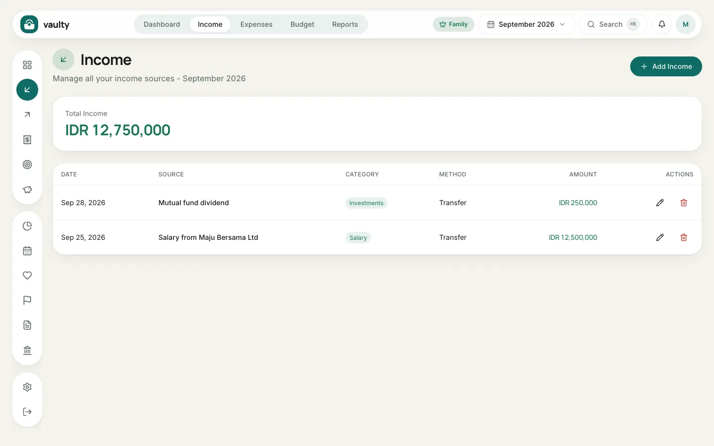
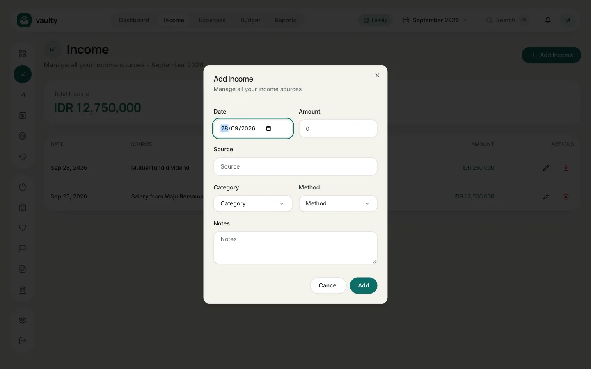

The **Income** menu holds all money coming in: salary, bonuses, freelance work, dividends, and more.

## Adding income

1. Open **Income** from the top menu or the icon on the left.
2. Click **Add Income**.
3. Fill in the form:
   - **Date** the money was received,
   - **Amount** in Rupiah,
   - **Source**, for example "Salary from Maju Bersama Ltd",
   - **Category** and **Method** (choices come from [Master data](/en/panduan/master-data/)),
   - **Notes** (optional).
4. Click **Add**.

## Editing or deleting

In the **Actions** column of each row there is a **pencil** icon to edit and a **trash** icon to delete. Deleted items go to the organization's trash so they can be restored.

## Tips

- Record fixed income (salary) on its real date so the monthly cash flow is accurate.
- The Free plan is limited to 50 transactions per month (income and expenses combined).
