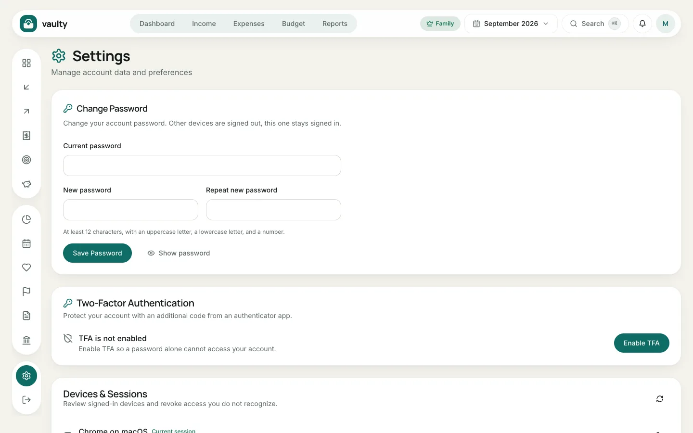

Open **Settings** from the gear icon on the left or the account menu.

## Change password

Enter your current password, then the new one twice (at least 12 characters with an uppercase letter, a lowercase letter, and a number). Other devices are signed out automatically, this device stays signed in.

## Two-step verification (Personal and above)

Click **Enable 2FA**, scan the QR code with an authenticator app (the account is named "Vaulty"), enter the 6-digit code, and **keep the recovery codes** somewhere safe. From then on every sign-in needs a code from the app.

## Devices and sessions

The list of devices currently signed in. Click the sign-out icon next to a device you do not recognize to remove it.

## Install as an app

The **Install app** card helps you add Vaulty to your phone's home screen or your computer. On iPhone, follow the manual instructions shown.

## AI agent access (MCP)

Create a token to connect an AI assistant. The full guide is in [Connecting an AI agent](/en/agen-ai/menyambungkan-mcp/).

## Language, appearance, and currency

- **Language:** Bahasa Indonesia or English. Every screen, email, report, and invoice follows this choice.
- **Appearance:** light or dark mode.
- **Display currency** (Personal and above): numbers are converted for display. Your data is still stored in Rupiah.
