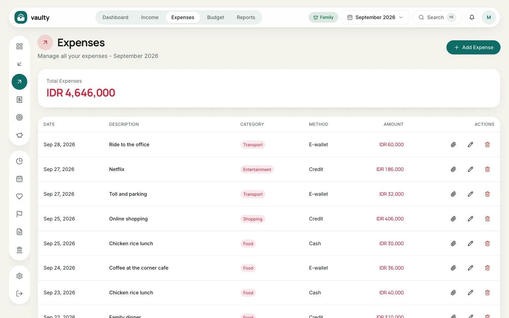
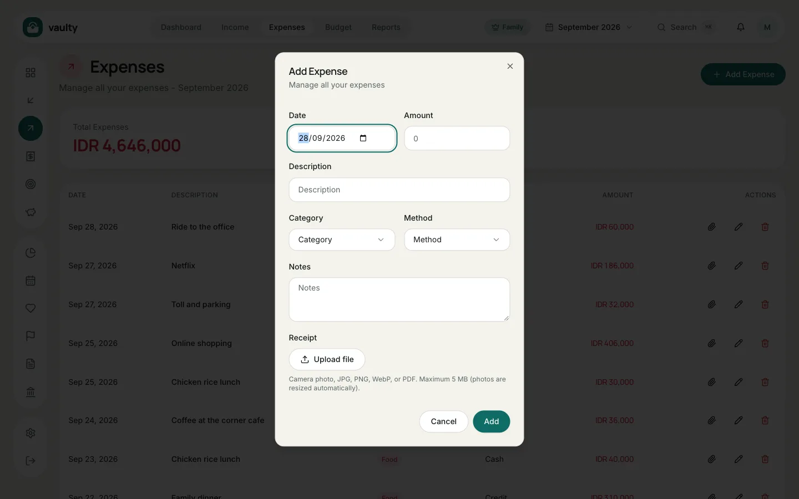
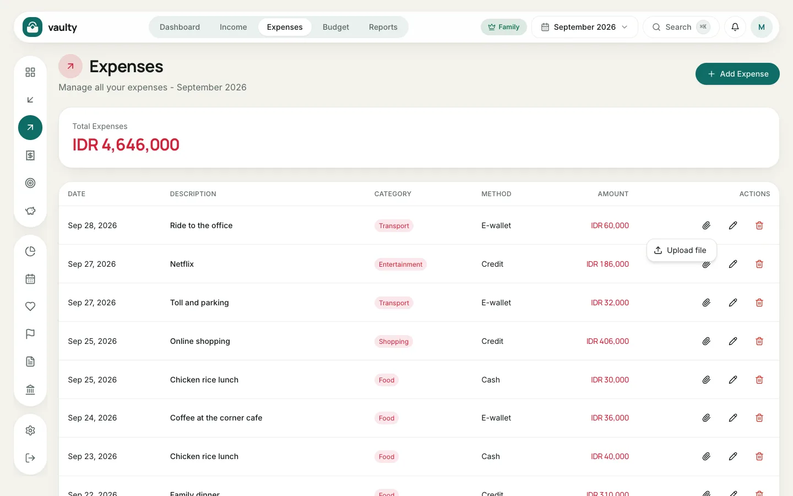

The **Expenses** menu holds all money going out, with category and payment method.

## Adding an expense

1. Open **Expenses**.
2. Click **Add Expense**.
3. Fill in **Date**, **Amount**, **Description**, **Category**, and **Method**. **Notes** can stay empty.
4. (Optional, Personal plan and above) In the **Proof** section, click **Upload file** to attach a receipt.
5. Click **Add**.

## Attaching a receipt to an existing expense

Click the **paperclip** icon in the **Actions** column of the row, then choose:

- **Take photo** with the rear camera (shown on phones and tablets), or
- **Upload file** for JPG, PNG, WebP, or PDF.

Photos from the camera are shrunk automatically in the browser so they fit the 5 MB limit.

## Tips

- Use consistent descriptions ("Fuel", not sometimes "filled up the tank"), so items are easy to search and group.
- If you often record the same thing, create a **Category Rule** in [Planning](/en/panduan/perencanaan/) so the category fills in by itself.
