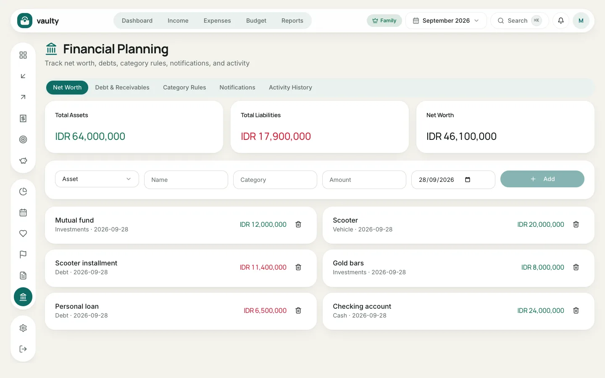
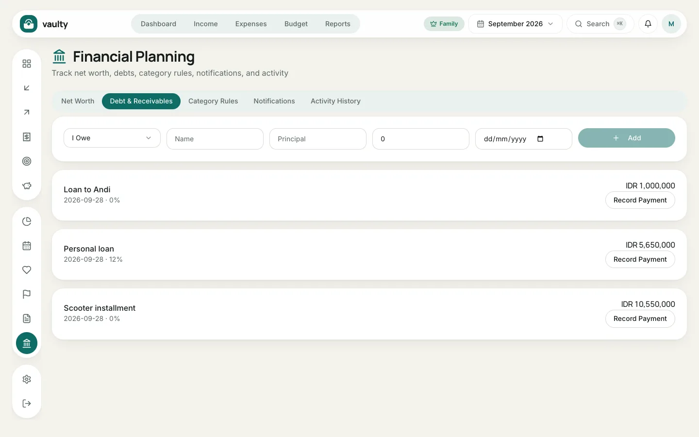
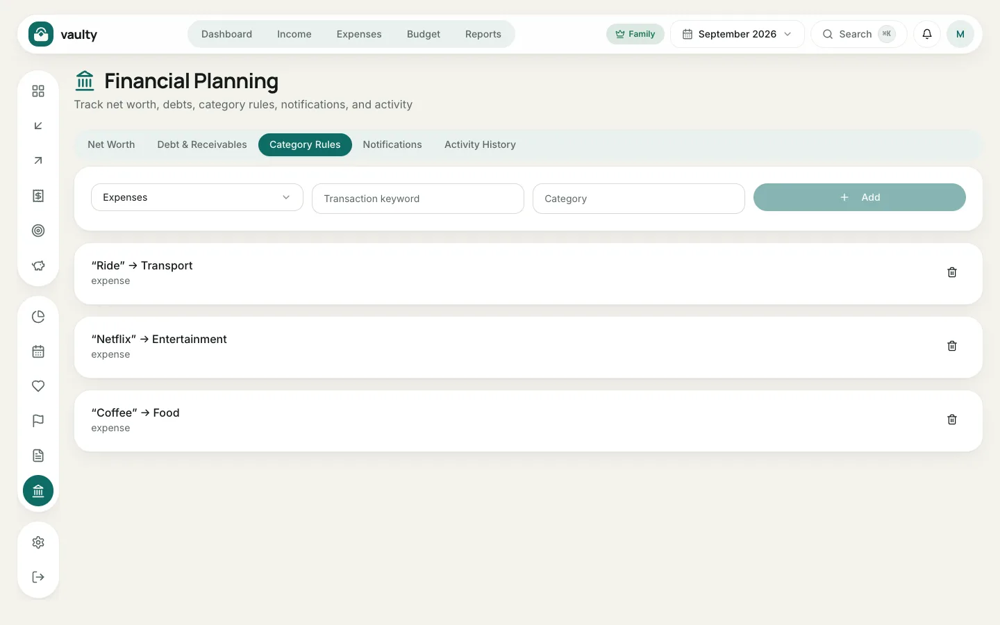
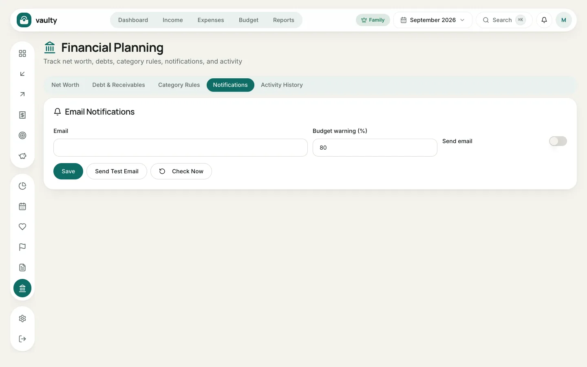

The **Planning** menu has five tabs. Debts, rules, and email notifications are on the **Personal** plan and above.

## Net Worth

Record **assets** (bank savings, mutual funds, gold, vehicles) and **liabilities** (debts). The cards at the top show **Total Assets**, **Total Liabilities**, and **Net Worth** (assets minus liabilities).

1. Choose **Asset** or **Liability**.
2. Fill in **Name**, **Category**, **Amount**, and the value date.
3. Click **Add**. Update the values regularly so the numbers stay right.

## Debt & Receivables

1. Choose **I Owe** (you owe money) or a receivable (someone owes you).
2. Fill in **Name**, **Principal** (the starting amount), the remaining amount, and the due date.
3. Click **Add**.
4. Each time you pay an installment, click **Record Payment** and enter the amount. The remaining debt goes down automatically.

## Category Rules

Rules fill in the category automatically from keywords in the description. For example, the word "Ride" always goes to the Transport category. Create rules for transactions that repeat often so recording is faster.

## Notifications

The list of alerts from Vaulty: bills due, budgets nearly used up, debt installments, and your subscription. This is also where you set up **email reminders** (destination address, how many days ahead, and the budget threshold) and can send a test email.

## Activity History

A record of every change in the organization: who added, changed, or deleted what, and when. Useful for families sharing data.
