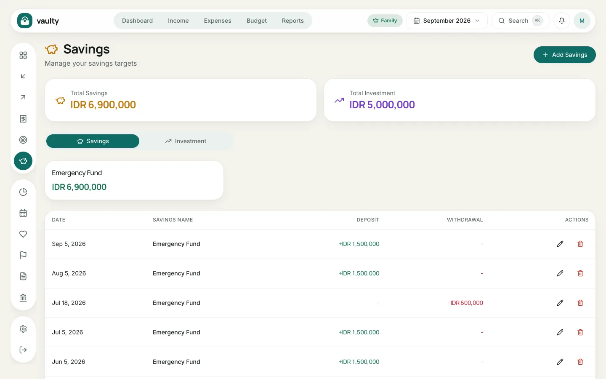
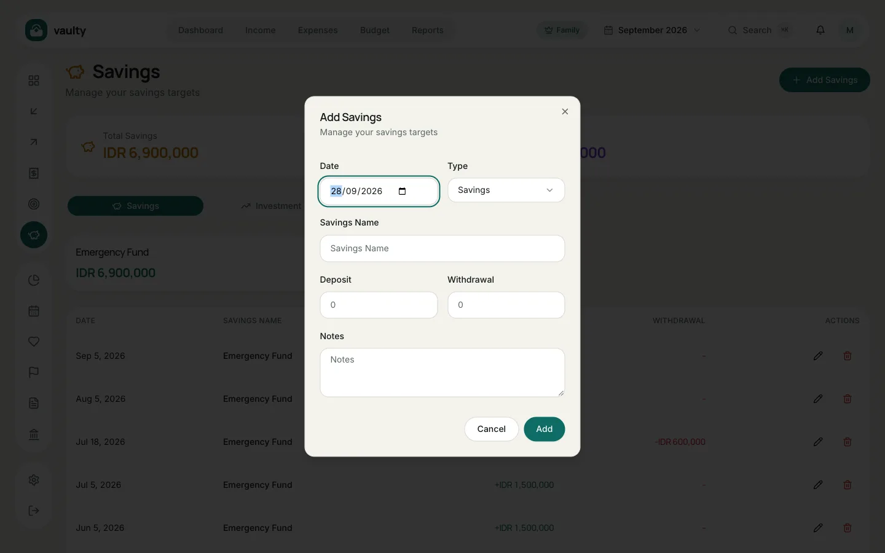
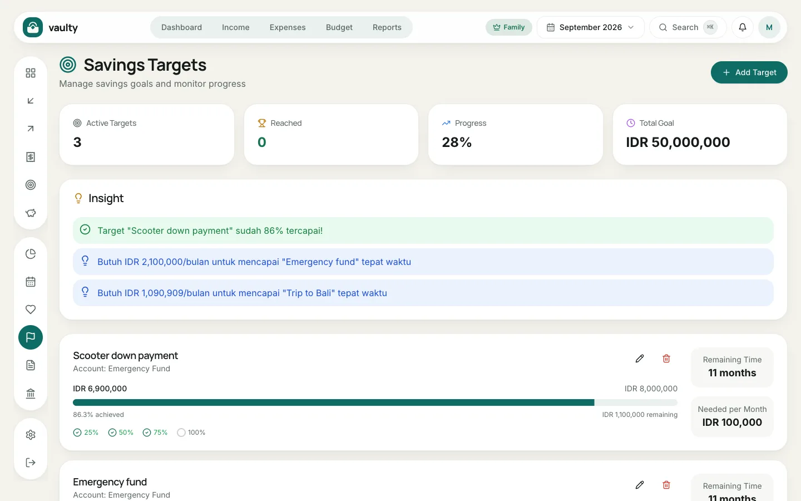
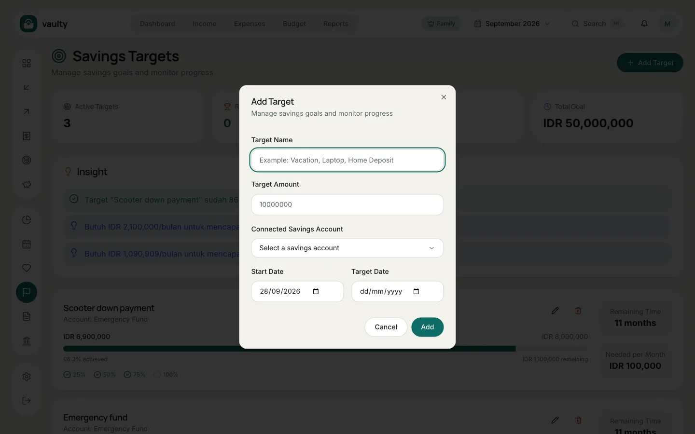

Two menus that work as a pair: **Savings** for recording money saved or invested, and **Goals** for what you want to reach. Both are on the **Personal** plan and above.

## Recording savings

1. Open **Savings** and click **Add Savings**.
2. Choose the **Date** and **Type** (**Savings** or **Investments**).
3. Enter the **Savings Name**, for example "Emergency Fund" or "Mutual Fund".
4. Enter a **Deposit** for money going in, or a **Withdrawal** for money taken out.
5. Click **Add**.

Each account's balance is deposits minus withdrawals, shown on the cards above the list.

## Creating a goal

1. Open **Goals** and click **Add Target**.
2. Enter the **Target Name** (for example "Trip to Bali") and the **Target Amount**.
3. Choose the **Connected Savings Account**: that account's balance counts as progress.
4. Pick the **Start Date** and **Target Date**.
5. Click **Add**.

Each goal shows progress, **Remaining Time**, and **Needed per Month**: how much to save every month to arrive on time. The **Insight** section at the top tells you which goals are nearly done.
