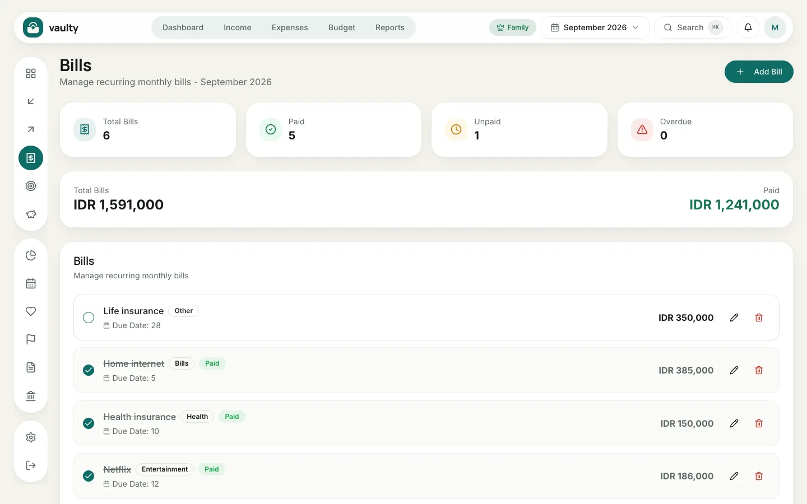
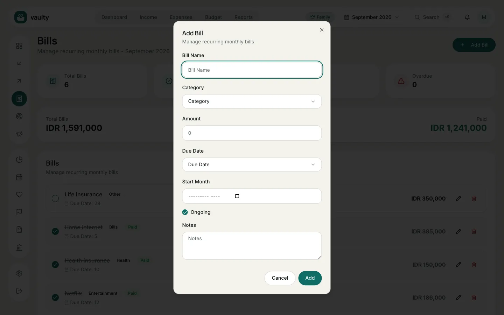

**Bills** is for regular expenses such as electricity, internet, and subscriptions, so none slip by. Available on the **Personal** plan and above.

## Adding a bill

1. Open **Bills** and click **Add Bill**.
2. Fill in **Bill Name**, **Category**, and **Amount**.
3. Choose the **Due Date** (1 to 31) and **Start Month**.
4. Leave **Ongoing** on for a bill with no end date, or turn it off and set an end month.
5. Click **Add**.

## Marking it paid

Click the circle to the left of the bill name. The bill becomes **Paid** (struck through), and the payment is recorded as an expense for that month.

## Reading the summary

The four cards at the top show **Total Bills**, **Paid**, **Unpaid**, and **Overdue**. A bill past its due date without payment gets a red **Overdue** label, and bills nearing their due date show up in the **Upcoming bills** card on the dashboard.
