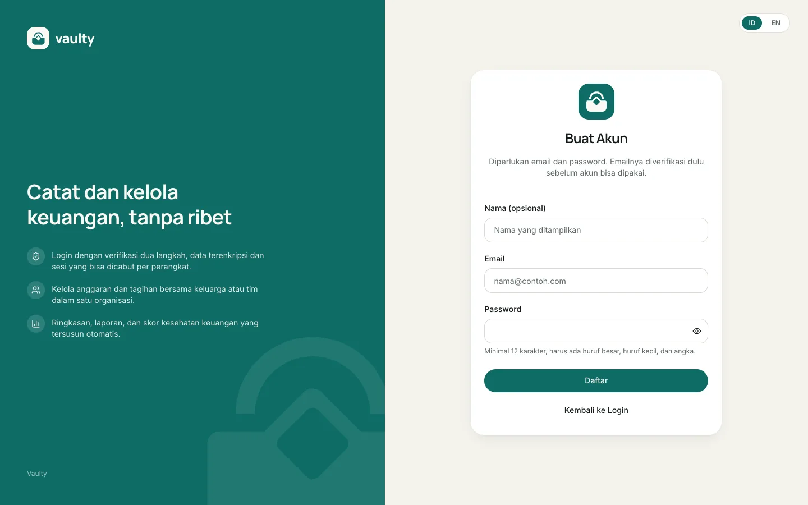
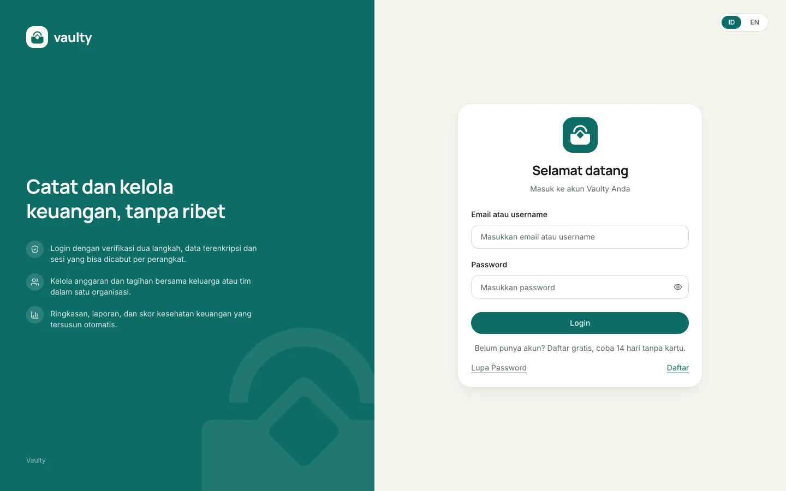

## Daftar

Kamu bisa daftar dengan dua cara:

1. **Email dan password.** Password minimal 12 karakter dengan huruf besar, huruf kecil, dan angka. Setelah daftar, kami mengirim email verifikasi. Klik tautan di dalamnya (berlaku 24 jam) untuk mengaktifkan akun.
2. **Lanjutkan dengan Google.** Akunmu langsung aktif tanpa email verifikasi. Kalau email Google-mu sudah terdaftar dengan password, akunnya digabung, bukan dibuat ganda.

Setiap akun baru mendapat **trial 14 hari** tanpa kartu. Setelah verifikasi (atau saat akun Google dibuat) kamu menerima email selamat datang.

:::note
Semua email dari Vaulty dikirim ke alamat yang terdaftar di akunmu. Kalau email verifikasi tidak masuk, cek folder spam, lalu minta kirim ulang dari halaman masuk.
:::

## Masuk

Masuk memakai email atau username dan password, atau tombol Google. Kalau kamu mengaktifkan [verifikasi dua langkah](#keamanan-akun), kamu juga diminta kode dari aplikasi authenticator.

## Lupa password

Pilih **Lupa Password** di halaman masuk, isi emailmu, lalu ikuti tautan yang dikirim (berlaku 1 jam dan hanya sekali pakai). Demi keamanan, jawaban halaman ini sama untuk email yang terdaftar maupun tidak.

## Keamanan akun

Di **Pengaturan** kamu bisa:

- mengganti password (perangkat lain otomatis keluar),
- mengaktifkan **verifikasi dua langkah** (paket Personal ke atas),
- melihat perangkat yang sedang masuk dan mengeluarkannya.

## Tampilan halaman

