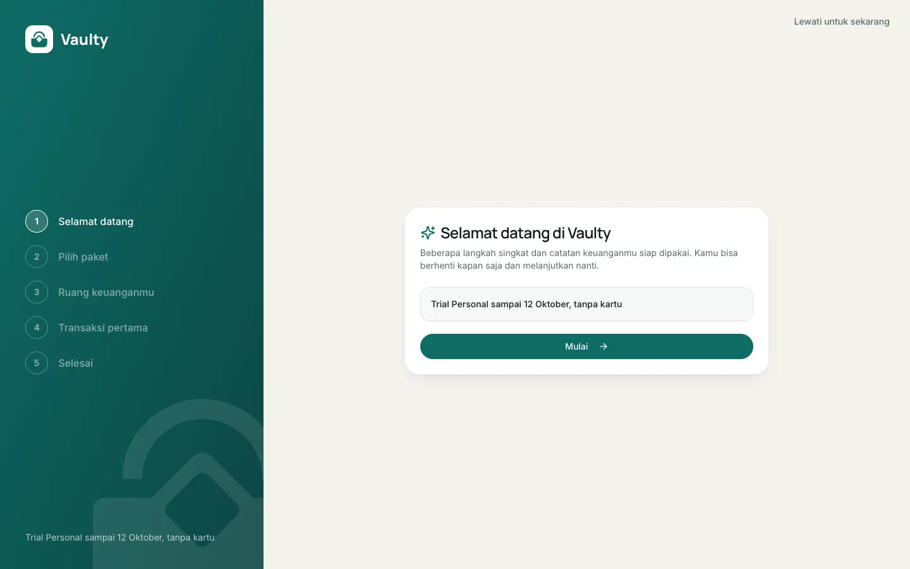
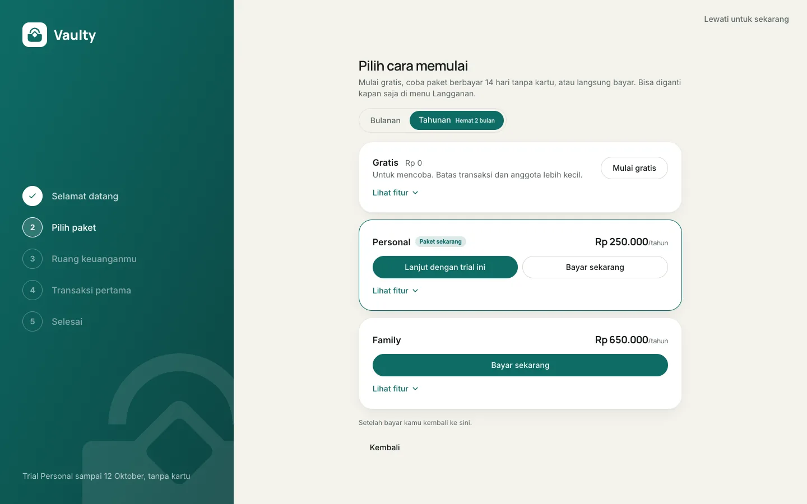
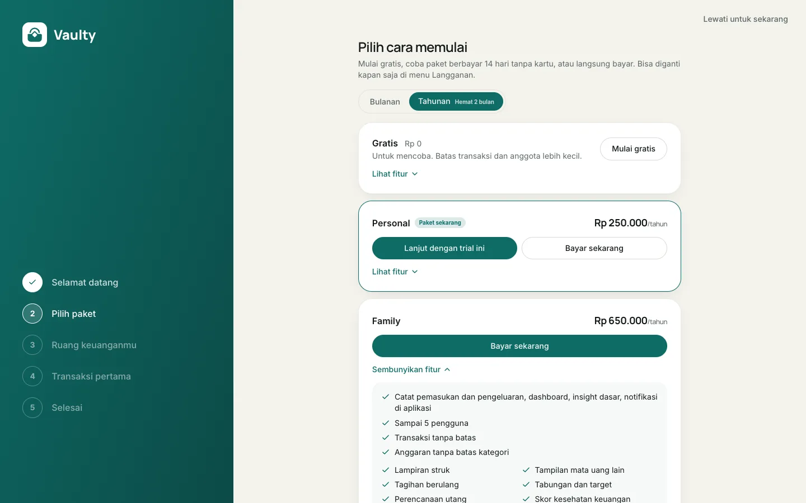
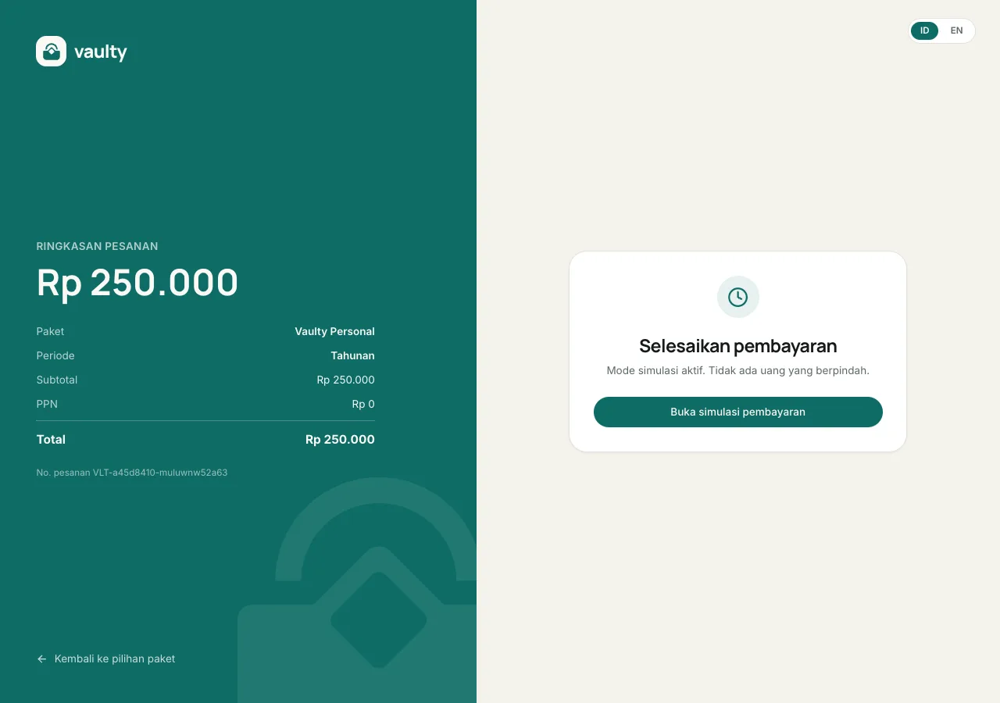
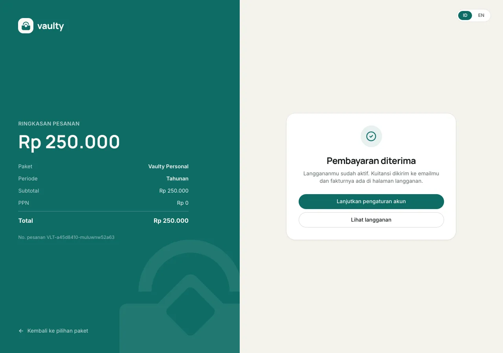
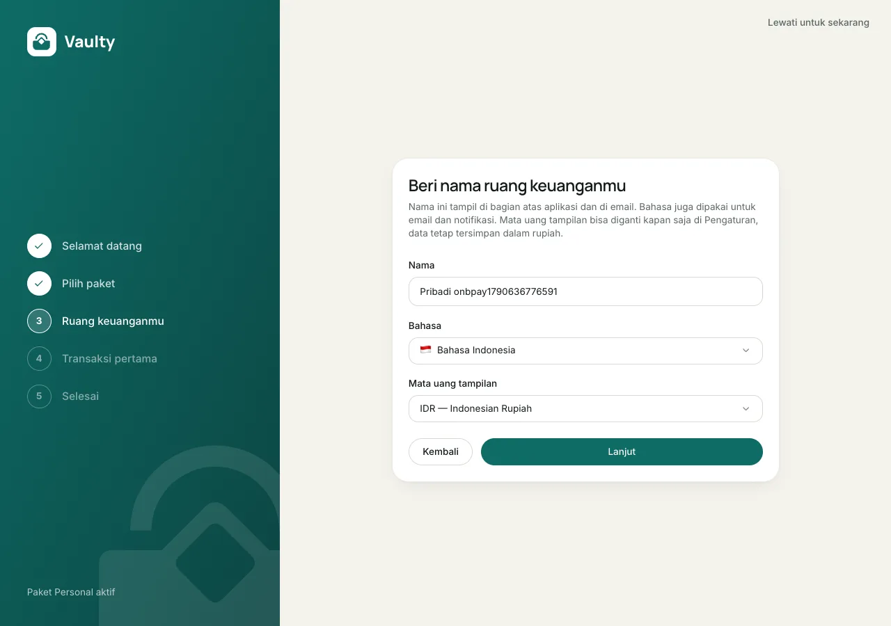
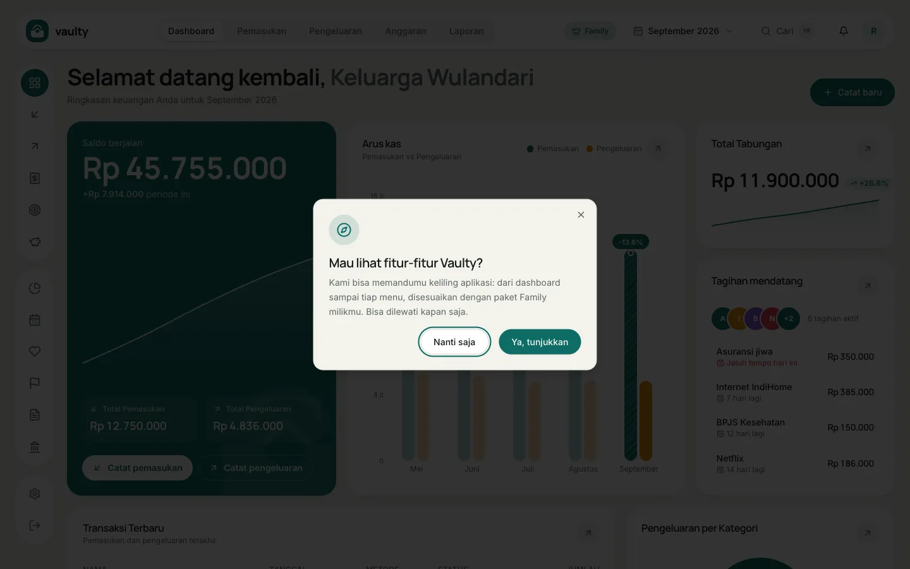
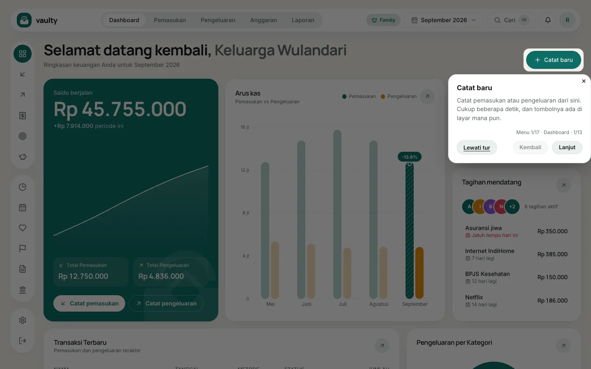

## Onboarding

Saat pertama kali masuk, kamu melewati lima langkah singkat:

1. **Selamat datang.**
2. **Pilih paket.** Trial Personal 14 hari, paket Gratis, atau langsung berbayar. Bisa diganti nanti.
3. **Workspace.** Nama workspace, bahasa, dan mata uang tampilan.
4. **Transaksi pertama.** Bisa memakai data contoh, atau dilewati.
5. **Selesai.** Layar konfirmasi dengan tombol ke dashboard.

Semua langkah bisa dilewati lewat tombol di pojok kanan atas.

## Tur produk

Pertama kali kamu membuka dashboard, Vaulty bertanya **"Mau lihat fitur-fitur Vaulty?"**.

- **Ya, tunjukkan:** tur berjalan dari dashboard lalu ke tiap menu, dengan penjelasan fungsi menu, tombol tambah, dan cara membaca daftarnya.
- **Nanti saja:** kamu diberi tahu bahwa tur bisa dimulai lagi kapan saja.

Tur **menyesuaikan paketmu**: halaman yang tidak termasuk paketmu dilewati, dan di akhir ada ringkasan fitur di paket yang lebih tinggi. Tombol **Lewati tur** tersedia di setiap langkah.

### Mengulang tur

Buka menu akun (avatar di pojok kanan atas di komputer, atau menu di ponsel), lalu pilih **Tur produk**.

## Tampilan

Langkah 1, selamat datang:

Langkah 2, pilih paket. Klik **Lihat fitur** untuk membuka rincian tiap paket:

Langkah 3, ruang keuanganmu:

## Kalau kamu langsung bayar di langkah 2

Memilih **Bayar sekarang** di langkah "Pilih paket" membuka halaman pembayaran yang sama dengan menu Langganan di dashboard: ringkasan pesanan di kiri, cara bayar Midtrans tertanam di kanan.

Setelah pembayaran diterima, tombol **Lanjutkan pengaturan akun** mengantarmu balik ke onboarding, tepat di langkah "Ruang keuanganmu" (bukan mengulang dari langkah 1).

### Pertanyaan tur dan langkah pertamanya

