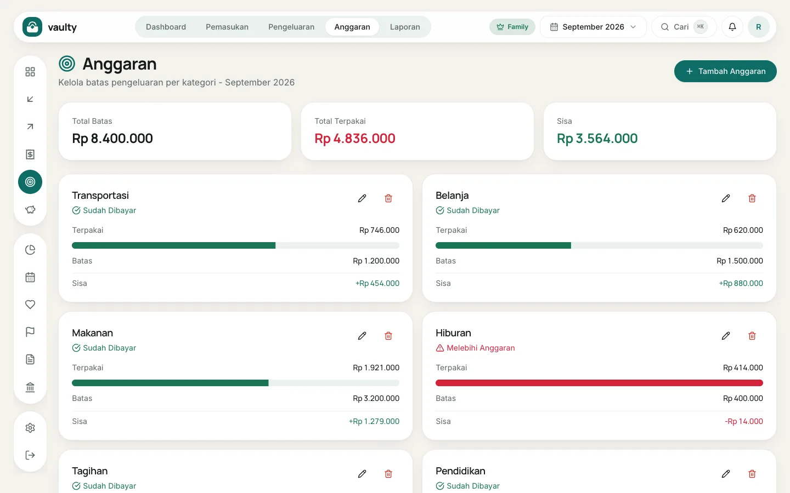
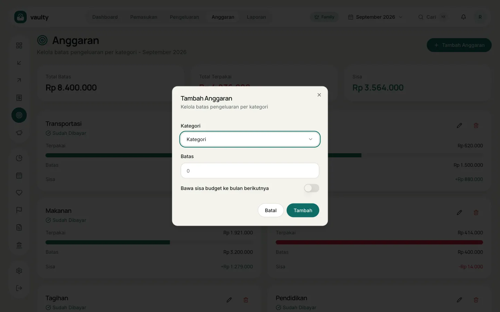

**Anggaran** membantu menahan pengeluaran per kategori setiap bulan.

## Membuat anggaran

1. Buka **Anggaran** dan pilih bulan di pemilih atas.
2. Klik **Tambah Anggaran**.
3. Pilih **Kategori** dan isi **Batas** (jumlah maksimal untuk bulan itu).
4. (Opsional) Nyalakan **Bawa sisa budget ke bulan berikutnya** kalau sisa anggaran ingin ditambahkan ke bulan depan.
5. Klik **Tambah**.

## Membaca kartunya

Tiap kartu menampilkan **Terpakai**, **Batas**, dan **Sisa**. Bilah progres berubah **merah** dan sisanya menjadi negatif saat pengeluaran melewati batas. Di atas kartu ada total batas, total terpakai, dan total sisa untuk bulan itu.

## Catatan

- Paket Gratis: maksimal **3 kategori** anggaran.
- Anggaran dibuat per bulan. Untuk bulan baru, tambahkan lagi atau pakai opsi bawa sisa.
- Notifikasi anggaran hampir habis dikirim lewat lonceng dan (paket Personal ke atas) email. Atur di [Perencanaan](/panduan/perencanaan/).
