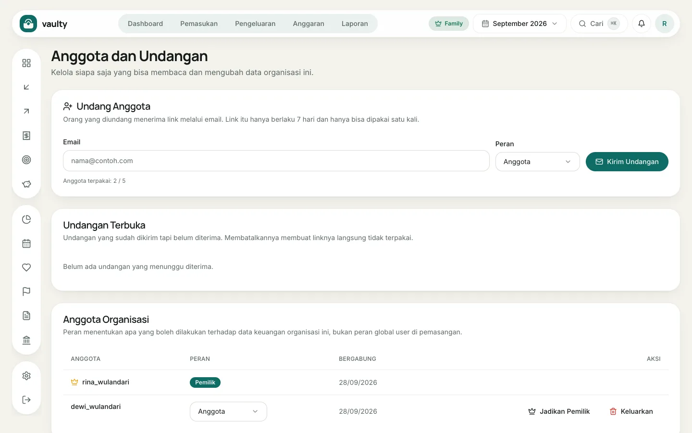

Paket **Family** memungkinkan sampai **5 pengguna** berbagi satu organisasi. Semua anggota melihat data yang sama. Buka dari menu akun, pilih **Anggota**.

## Mengundang anggota

1. Isi **Email** orang yang diundang.
2. Pilih **Peran**.
3. Klik **Kirim Undangan**.

Orang itu menerima email berisi tautan yang **berlaku 7 hari dan hanya bisa dipakai sekali**. Undangan yang belum diterima tampil di **Undangan Terbuka** dan bisa dibatalkan (tautannya langsung tidak berlaku). Penghitung di bawah formulir menunjukkan kuota, misalnya "2 / 5".

## Peran

| Peran | Boleh |
|---|---|
| **Owner** (pemilik) | semuanya, termasuk langganan, akses agen AI, dan menghapus organisasi |
| **Admin** | mencatat dan mengubah data, mengelola anggota, memulihkan cadangan |
| **Member** | membaca, mencatat, mengubah, dan menghapus data keuangan |
| **Viewer** | hanya membaca |

## Mengubah atau mengeluarkan anggota

Di tabel **Anggota Organisasi**, ubah peran lewat kotak pilihan, atau klik **Hapus** untuk mengeluarkan anggota. **Jadikan Pemilik** memindahkan kepemilikan organisasi ke anggota tersebut.

Anggota yang dikeluarkan langsung kehilangan akses, termasuk token agen AI yang dia buat.
