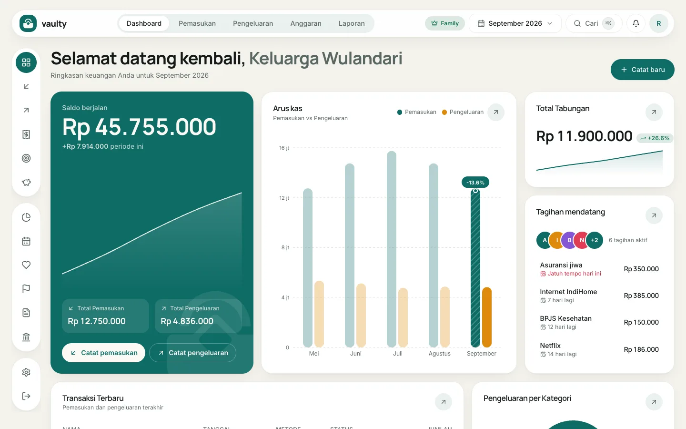

Dashboard adalah halaman pertama setelah masuk. Isinya ringkasan keuangan untuk bulan yang dipilih.

## Yang ada di halaman ini

- **Saldo berjalan:** pemasukan dikurangi pengeluaran pada periode yang dipilih, beserta **Total Pemasukan** dan **Total Pengeluaran**.
- **Arus kas:** batang pemasukan dan pengeluaran per bulan, untuk melihat tren beberapa bulan terakhir.
- **Total Tabungan:** jumlah semua tabungan dan pertumbuhannya.
- **Tagihan mendatang:** tagihan rutin yang akan jatuh tempo, urut dari yang terdekat.
- **Transaksi Terbaru** dan **Pengeluaran per Kategori** di bagian bawah.

## Yang bisa kamu lakukan

1. **Ganti periode** lewat pemilih bulan di bagian atas (misalnya "September 2026"). Semua kartu mengikuti bulan itu.
2. **Catat transaksi cepat** dengan tombol **Catat baru** di kanan atas, atau tombol **Catat pemasukan** dan **Catat pengeluaran** di kartu saldo.
3. **Cari** transaksi lewat kotak **Cari** (atau tekan `Ctrl` / `Cmd` + `K`).
4. Buka **lonceng** untuk melihat notifikasi, misalnya tagihan jatuh tempo atau anggaran hampir habis.
5. Klik **avatar** di kanan atas untuk membuka menu akun: organisasi, anggota, master data, langganan, pengaturan, dan **Tur produk**.

Badge di samping pemilih bulan (misalnya **Family**) menunjukkan paketmu. Klik untuk membuka halaman langganan.
