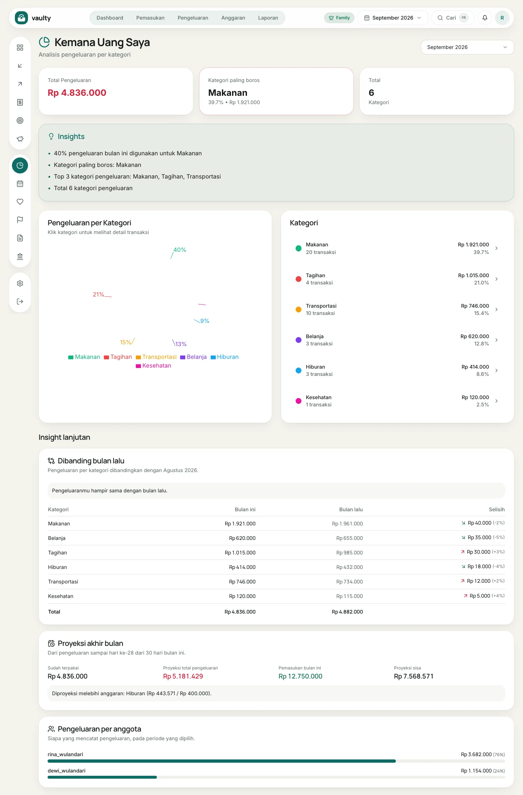
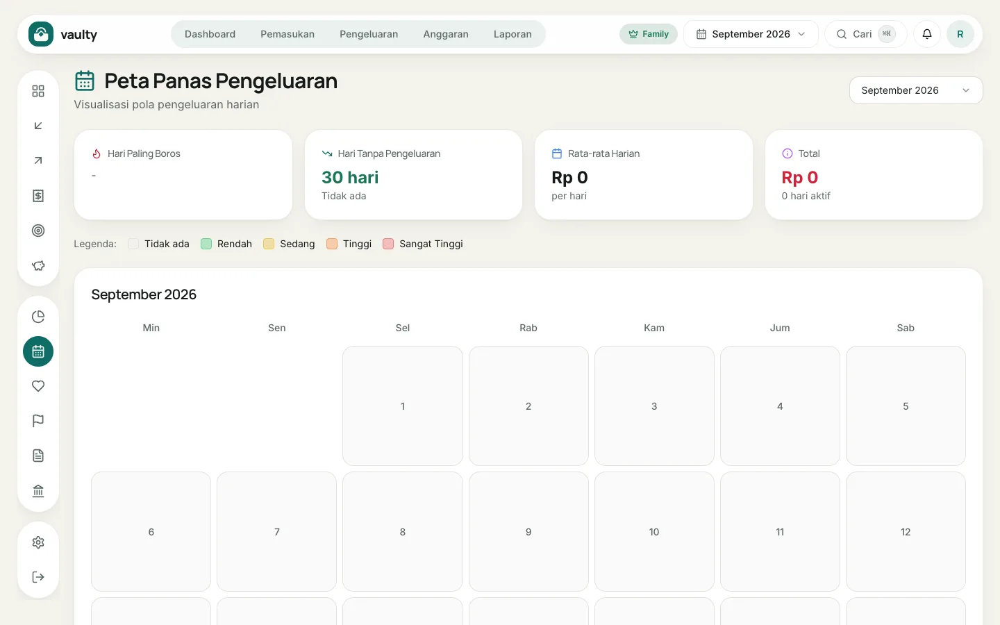
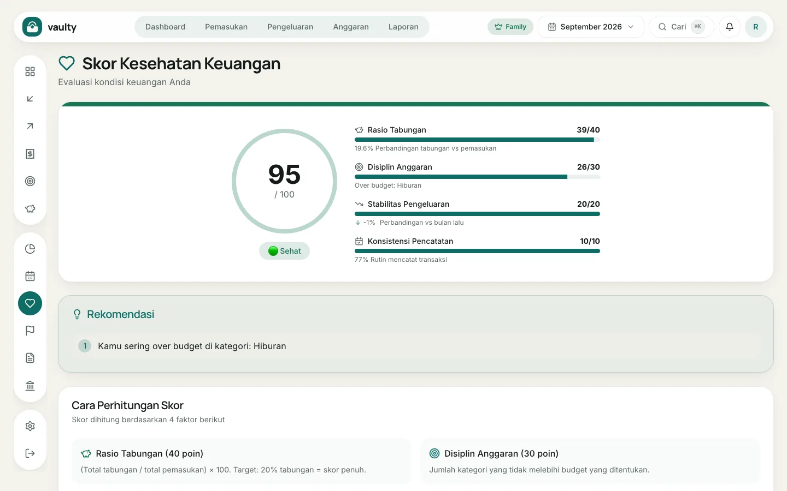

Tiga halaman yang membantu membaca datamu, bukan sekadar mencatatnya.

## Kemana Uang Saya (Insight)

Halaman ini menunjukkan pengeluaranmu per kategori untuk bulan yang dipilih: grafik lingkaran, peringkat kategori, dan beberapa kalimat insight otomatis. Klik sebuah kategori untuk melihat transaksinya. Tersedia di semua paket.

### Insight lanjutan (paket Family)

Di bagian bawah halaman, paket Family mendapat tiga analisis tambahan:

1. **Dibanding bulan lalu:** tabel per kategori (bulan ini, bulan lalu, selisih dan persentasenya) dengan ringkasan seperti "pengeluaranmu naik 40%, terutama di Makanan".
2. **Proyeksi akhir bulan:** perkiraan total pengeluaran sampai akhir bulan berdasarkan laju sejauh ini, dibandingkan dengan pemasukan, dan daftar kategori beranggaran yang diproyeksi melebihi batasnya. Proyeksi hanya untuk bulan berjalan dan baru muncul setelah ada data minimal 5 hari.
3. **Pengeluaran per anggota:** siapa mencatat berapa, berguna untuk keluarga.

Paket lain melihat ajakan untuk upgrade di bagian ini.

## Peta panas (Personal ke atas)

Peta panas menunjukkan **hari dan waktu pengeluaranmu paling banyak**. Warna lebih pekat berarti pengeluaran lebih besar. Berguna untuk menemukan kebiasaan, misalnya belanja berlebihan di akhir pekan.

## Skor kesehatan keuangan (Personal ke atas)

Skor 0 sampai 100 dari empat komponen:

| Komponen | Bobot | Yang dinilai |
|---|:---:|---|
| Rasio Tabungan | 40 | tabungan dibanding pemasukan (target 20%) |
| Disiplin Anggaran | 30 | kategori yang tidak melewati anggaran |
| Stabilitas Pengeluaran | 20 | perubahan pengeluaran dibanding bulan lalu |
| Konsistensi Pencatatan | 10 | seberapa rutin kamu mencatat |

Di bawah skor ada **Rekomendasi** yang menunjukkan hal paling berpengaruh untuk diperbaiki.
