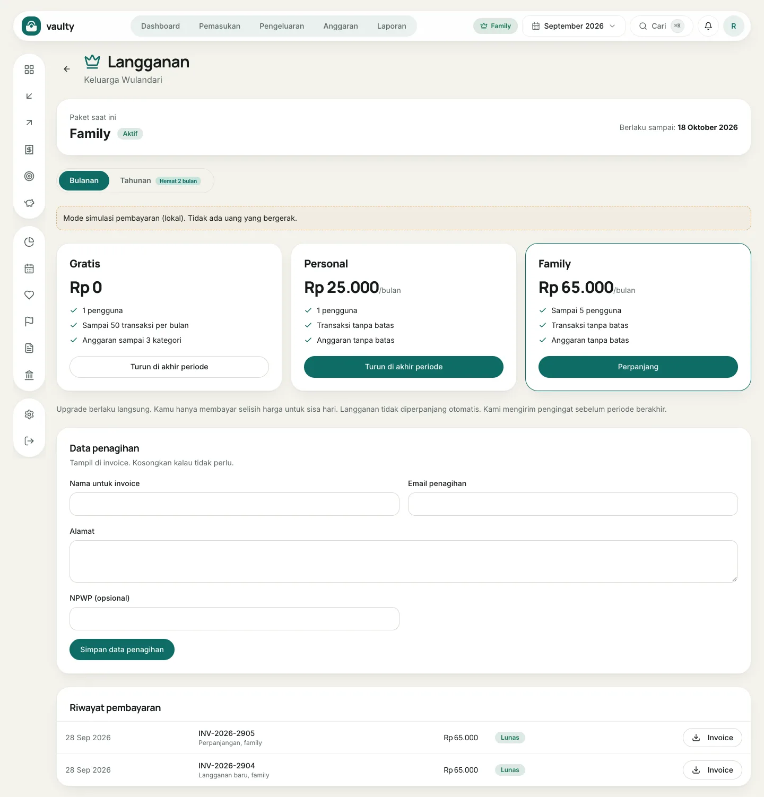

Buka **Langganan** dari badge paket di bagian atas atau dari menu akun. Hanya **pemilik** organisasi yang bisa membayar dan mengubah paket.

## Yang ada di halaman

- **Paket saat ini** dan tanggal berlakunya (atau akhir trial).
- Pemilih **Bulanan** atau **Tahunan** (tahunan = 10 bulan, hemat 2 bulan).
- Tiga kartu paket: **Gratis**, **Personal**, dan **Family**, dengan tombol sesuai keadaanmu.
- **Data penagihan** untuk invoice.
- **Riwayat pembayaran** dengan tombol unduh **Invoice**.

## Membayar atau naik paket

1. Pilih **Bulanan** atau **Tahunan**.
2. Klik **Bayar sekarang** (atau **Upgrade** / **Perpanjang**) pada paket yang dipilih.
3. Di halaman pembayaran, pilih cara bayar dan selesaikan. Lihat [Pembayaran dan invoice](/paket/pembayaran-dan-invoice/).

Upgrade berlaku langsung dan kamu hanya membayar **selisih harga** untuk sisa periode.

## Turun paket

Klik tombol turun paket pada paket yang lebih rendah. Perubahannya berlaku di **akhir periode berjalan**, dan kamu tetap memakai paket sekarang sampai saat itu.

## Data penagihan dan invoice

Isi **Nama pada invoice**, **Email penagihan**, **Alamat**, dan **NPWP** (opsional), lalu **Simpan data penagihan**. Data ini muncul di invoice berikutnya. Unduh invoice PDF lewat tombol **Invoice** di **Riwayat pembayaran**.
