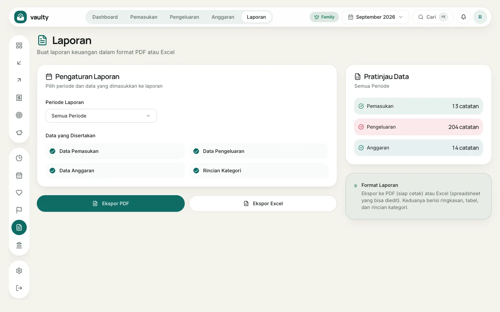

Menu **Laporan** membuat dokumen berisi ringkasan, tabel, dan rincian kategori. Ekspor PDF dan Excel tersedia di paket **Personal** ke atas.

## Langkah

1. Buka **Laporan**.
2. Pilih **Periode Laporan**: satu bulan tertentu atau **Semua Periode**.
3. Di **Data yang Disertakan**, pilih bagian yang diinginkan: **Data Pemasukan**, **Data Pengeluaran**, **Data Anggaran**, dan **Rincian Kategori**.
4. Lihat **Pratinjau Data** di kanan untuk memastikan jumlah catatannya sesuai.
5. Klik **Ekspor PDF** (siap cetak) atau **Ekspor Excel** (bisa diedit).

Bahasa laporan mengikuti bahasa yang sedang kamu pakai di aplikasi: Indonesia atau Inggris, tidak dicampur.

## Kapan dipakai

- Arsip bulanan atau tahunan.
- Dibahas bersama pasangan atau keluarga.
- Bahan untuk mengisi laporan pajak atau pengajuan pinjaman.
