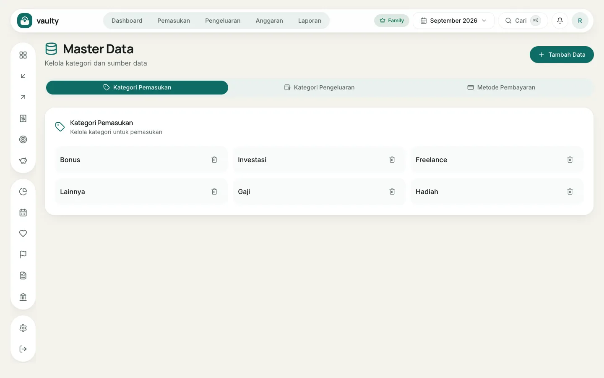
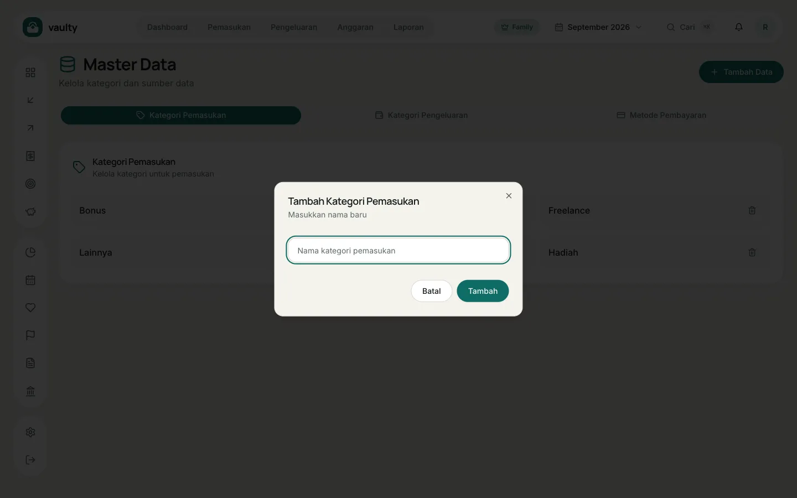

**Master data** adalah daftar pilihan yang muncul di formulir: kategori pemasukan, kategori pengeluaran, dan metode pembayaran. Buka dari menu akun (avatar di kanan atas).

## Menambah pilihan

1. Pilih tab: **Kategori Pemasukan**, **Kategori Pengeluaran**, atau **Metode Pembayaran**.
2. Klik **Tambah Data**.
3. Ketik nama baru lalu simpan.

## Menghapus

Klik ikon tempat sampah di samping nama. Transaksi lama yang sudah memakai nama itu **tidak berubah**, hanya pilihannya yang hilang dari formulir berikutnya.

## Catatan

- Daftar awal dibuat saat kamu mendaftar, dalam bahasa yang kamu pilih. Daftar ini milikmu dan tidak berganti kalau kamu mengubah bahasa aplikasi.
- Gunakan nama singkat dan konsisten supaya insight dan laporan rapi.
