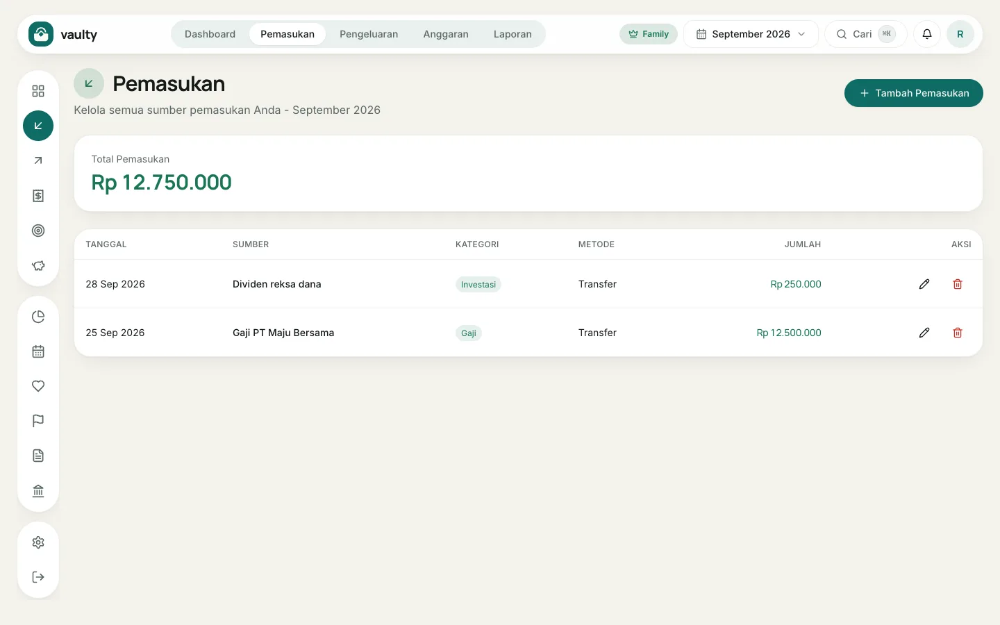
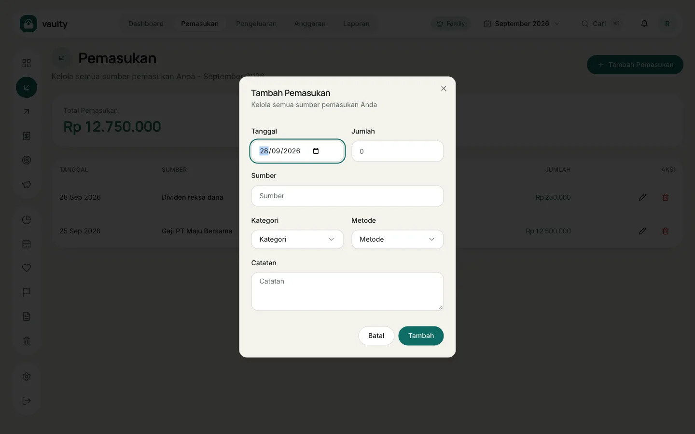

Menu **Pemasukan** berisi semua uang masuk: gaji, bonus, hasil freelance, dividen, dan lainnya.

## Menambah pemasukan

1. Buka **Pemasukan** dari menu atas atau ikon di sisi kiri.
2. Klik **Tambah Pemasukan**.
3. Isi formulir:
   - **Tanggal** kapan uang diterima,
   - **Jumlah** dalam Rupiah,
   - **Sumber**, misalnya "Gaji PT Maju Bersama",
   - **Kategori** dan **Metode** (pilihan berasal dari [Master data](/panduan/master-data/)),
   - **Catatan** (opsional).
4. Klik **Tambah**.

## Mengubah atau menghapus

Di kolom **Aksi** pada tiap baris ada ikon **pensil** untuk mengubah dan ikon **tempat sampah** untuk menghapus. Yang dihapus masuk ke kotak sampah organisasi sehingga bisa dipulihkan.

## Tips

- Catat pemasukan tetap (gaji) di tanggal sebenarnya supaya arus kas bulanan akurat.
- Paket Gratis dibatasi 50 transaksi per bulan (pemasukan dan pengeluaran digabung).
