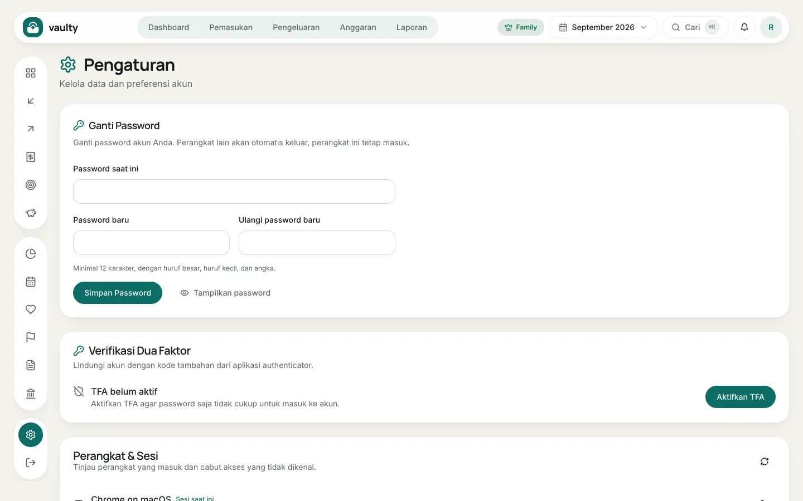

Buka **Pengaturan** dari ikon roda gigi di sisi kiri atau menu akun.

## Ganti password

Isi password saat ini, lalu password baru dua kali (minimal 12 karakter dengan huruf besar, huruf kecil, dan angka). Perangkat lain otomatis keluar, perangkat ini tetap masuk.

## Verifikasi dua langkah (Personal ke atas)

Klik **Aktifkan TFA**, pindai kode QR dengan aplikasi authenticator (nama akunnya "Vaulty"), masukkan kode 6 digit, lalu **simpan kode pemulihan** di tempat aman. Setelah itu setiap masuk butuh kode dari aplikasi.

## Perangkat dan sesi

Daftar perangkat yang sedang masuk. Klik ikon keluar di samping perangkat yang tidak kamu kenali untuk mengeluarkannya.

## Pasang sebagai aplikasi

Kartu **Pasang aplikasi** membantu menambahkan Vaulty ke layar utama ponsel atau komputer. Di iPhone, ikuti petunjuk manual yang tampil.

## Akses agen AI (MCP)

Buat token untuk menyambungkan asisten AI. Panduan lengkapnya ada di [Menyambungkan agen AI](/agen-ai/menyambungkan-mcp/).

## Bahasa, tampilan, dan mata uang

- **Bahasa:** Bahasa Indonesia atau English. Semua layar, email, laporan, dan invoice mengikuti pilihan ini.
- **Tampilan:** mode terang atau gelap.
- **Mata uang tampilan** (Personal ke atas): angka dikonversi untuk ditampilkan. Data tetap tersimpan dalam Rupiah.
