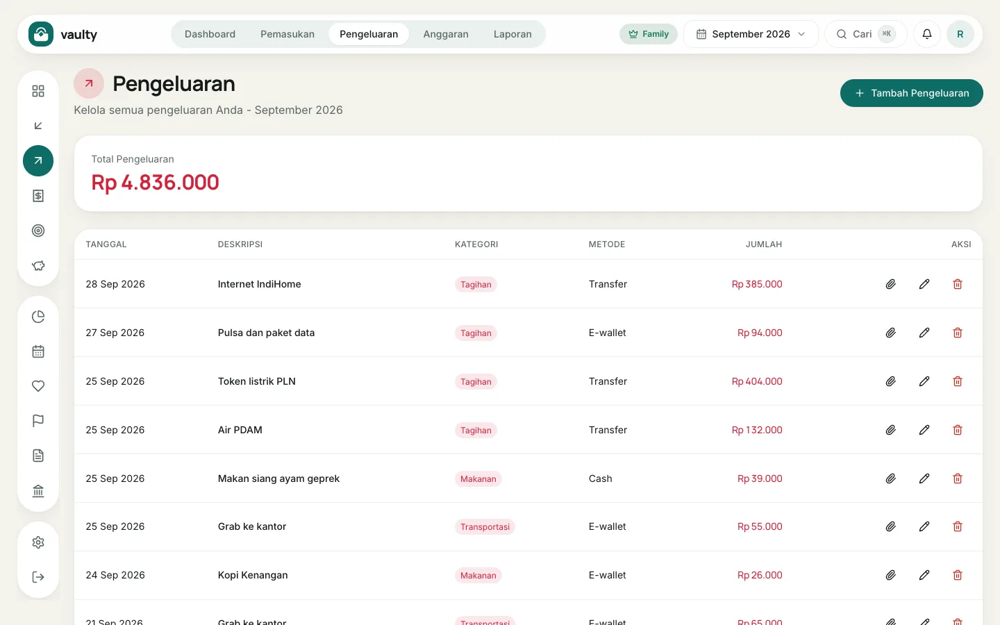
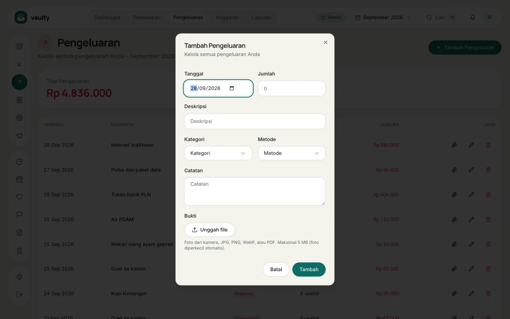
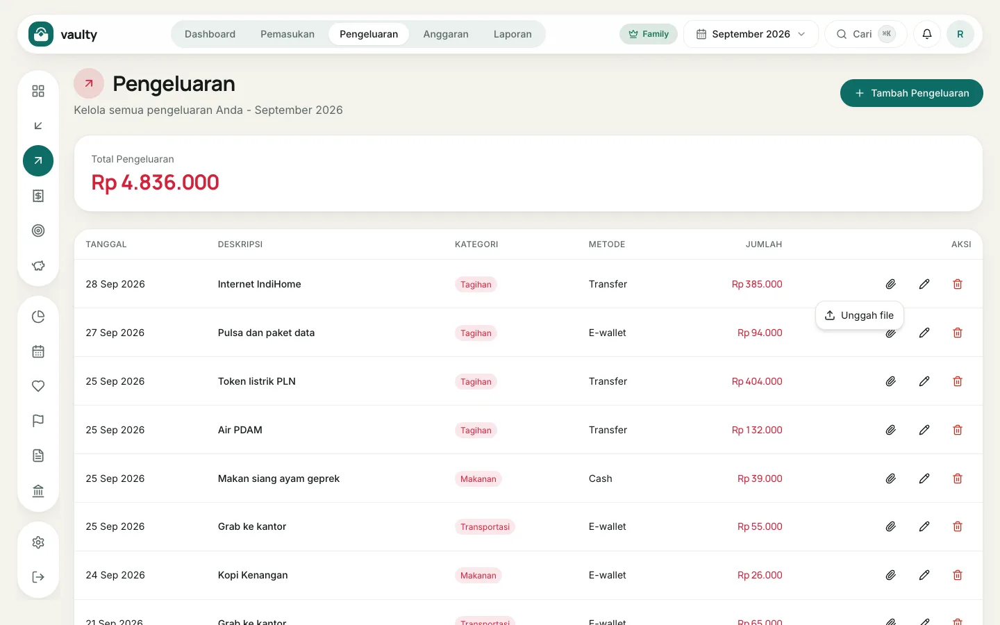

Menu **Pengeluaran** berisi semua uang keluar, lengkap dengan kategori dan metode pembayaran.

## Menambah pengeluaran

1. Buka **Pengeluaran**.
2. Klik **Tambah Pengeluaran**.
3. Isi **Tanggal**, **Jumlah**, **Deskripsi**, **Kategori**, dan **Metode**. **Catatan** boleh dikosongkan.
4. (Opsional, paket Personal ke atas) Di bagian **Bukti**, klik **Unggah file** untuk melampirkan struk.
5. Klik **Tambah**.

## Melampirkan struk ke pengeluaran yang sudah ada

Klik ikon **klip** di kolom **Aksi** pada baris yang dimaksud, lalu pilih:

- **Ambil foto** memakai kamera belakang (tampil di ponsel atau tablet), atau
- **Unggah file** untuk JPG, PNG, WebP, atau PDF.

Foto dari kamera diperkecil otomatis di browser supaya lolos batas 5 MB.

## Tips

- Pakai deskripsi yang konsisten ("Bensin Pertamax", bukan kadang "isi bensin"), supaya mudah dicari dan dikelompokkan.
- Kalau sering mencatat hal yang sama, buat **Aturan Kategori** di menu [Perencanaan](/panduan/perencanaan/) agar kategorinya terisi otomatis.
