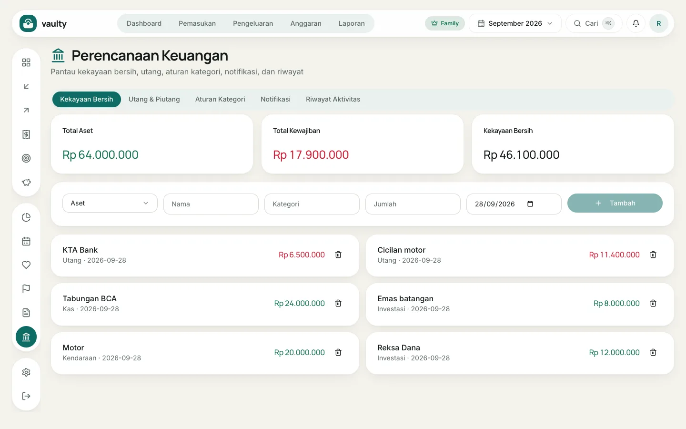
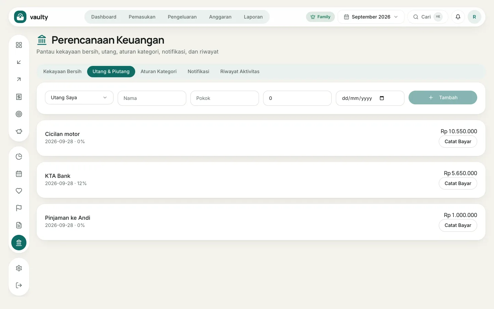
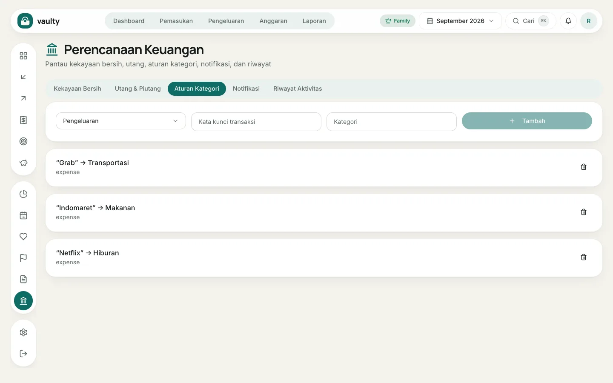
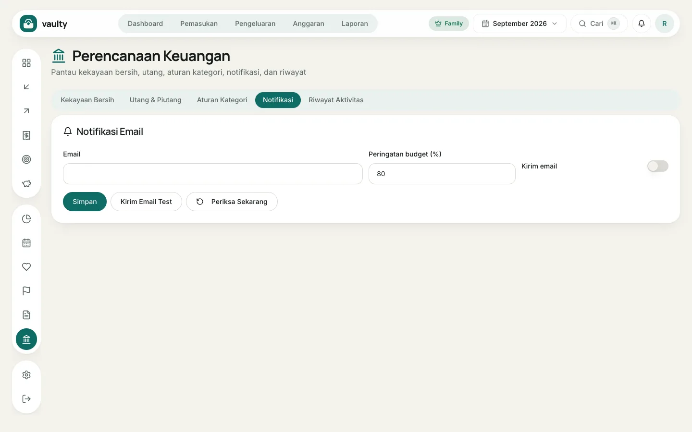

Menu **Perencanaan** punya lima tab. Bagian utang, aturan, dan notifikasi email tersedia di paket **Personal** ke atas.

## Kekayaan Bersih

Catat **aset** (tabungan bank, reksa dana, emas, kendaraan) dan **kewajiban** (utang). Kolom di atas kartu menunjukkan **Total Aset**, **Total Kewajiban**, dan **Kekayaan Bersih** (aset dikurangi kewajiban).

1. Pilih **Aset** atau **Kewajiban**.
2. Isi **Nama**, **Kategori**, **Jumlah**, dan tanggal nilainya.
3. Klik **Tambah**. Perbarui nilainya berkala supaya angkanya tetap benar.

## Utang & Piutang

1. Pilih **Utang Saya** (kamu berutang) atau piutang (orang lain berutang padamu).
2. Isi **Nama**, **Pokok** (jumlah awal), sisa, dan tanggal jatuh tempo.
3. Klik **Tambah**.
4. Setiap ada cicilan, klik **Catat Bayar** dan isi jumlahnya. Sisa utang berkurang otomatis.

## Aturan Kategori

Aturan mengisi kategori otomatis dari kata kunci deskripsi. Misalnya kata "Grab" selalu masuk kategori Transportasi. Buat aturan untuk transaksi yang sering berulang supaya pencatatan lebih cepat.

## Notifikasi

Daftar peringatan dari Vaulty: tagihan jatuh tempo, anggaran hampir habis, cicilan utang, dan langganan. Di sini juga kamu mengatur **pengingat email** (alamat tujuan, berapa hari sebelumnya, dan ambang anggaran) dan bisa mengirim email uji.

## Riwayat Aktivitas

Catatan semua perubahan di organisasi: siapa menambah, mengubah, atau menghapus apa, dan kapan. Berguna untuk keluarga yang berbagi data.
