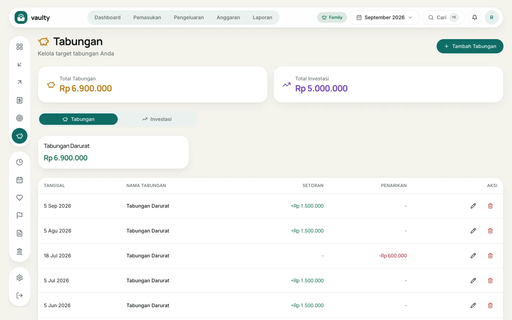
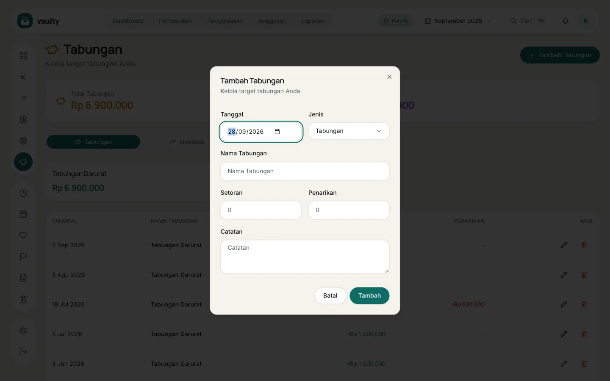
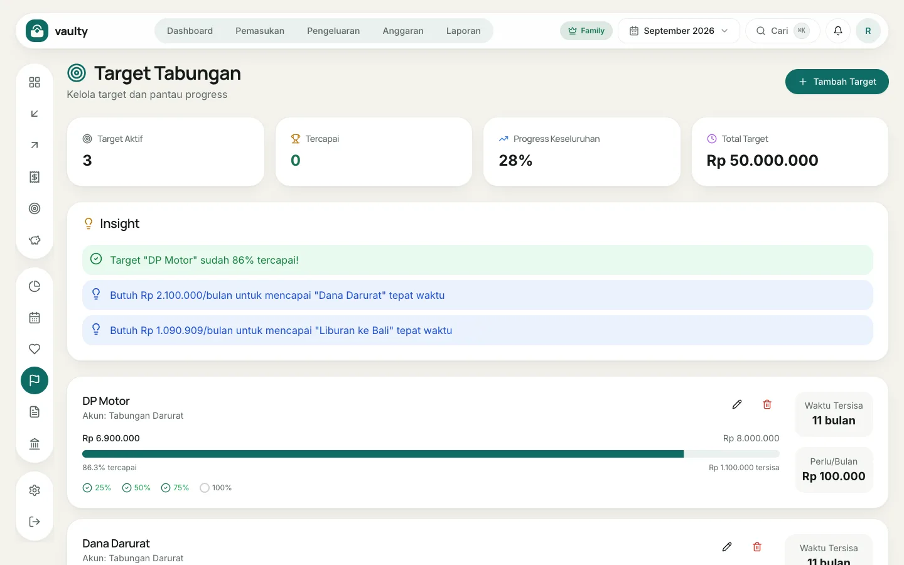
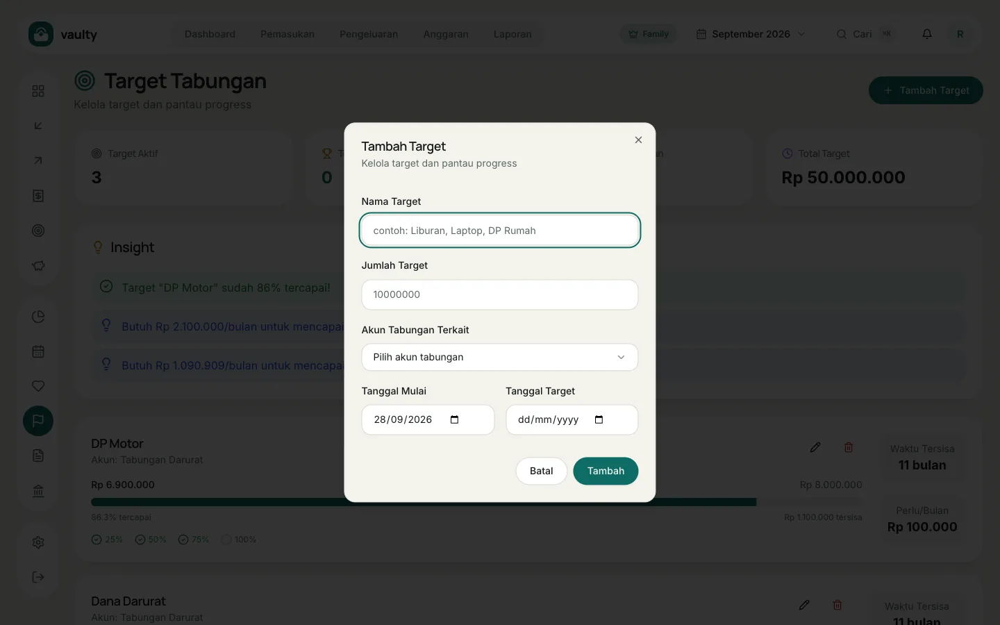

Dua menu yang bekerja berpasangan: **Tabungan** untuk mencatat uang yang ditabung atau diinvestasikan, dan **Target** untuk tujuan yang ingin dicapai. Keduanya untuk paket **Personal** ke atas.

## Mencatat tabungan

1. Buka **Tabungan** dan klik **Tambah Tabungan**.
2. Pilih **Tanggal** dan **Jenis** (**Tabungan** atau **Investasi**).
3. Isi **Nama Tabungan**, misalnya "Tabungan Darurat" atau "Reksa Dana".
4. Isi **Setoran** untuk uang yang masuk, atau **Penarikan** untuk uang yang diambil.
5. Klik **Tambah**.

Saldo tiap akun dihitung dari setoran dikurangi penarikan, dan tampil di kartu di atas daftar.

## Membuat target

1. Buka **Target** dan klik **Tambah Target**.
2. Isi **Nama Target** (misalnya "Liburan ke Bali") dan **Jumlah Target**.
3. Pilih **Akun Tabungan Terkait**: saldo akun itulah yang dihitung sebagai progres.
4. Pilih **Tanggal Mulai** dan **Tanggal Target**.
5. Klik **Tambah**.

Tiap target menampilkan progres, **Waktu Tersisa**, dan **Perlu/Bulan**: berapa yang harus ditabung tiap bulan agar sampai tepat waktu. Bagian **Insight** di atas memberi tahu target yang hampir tercapai.
