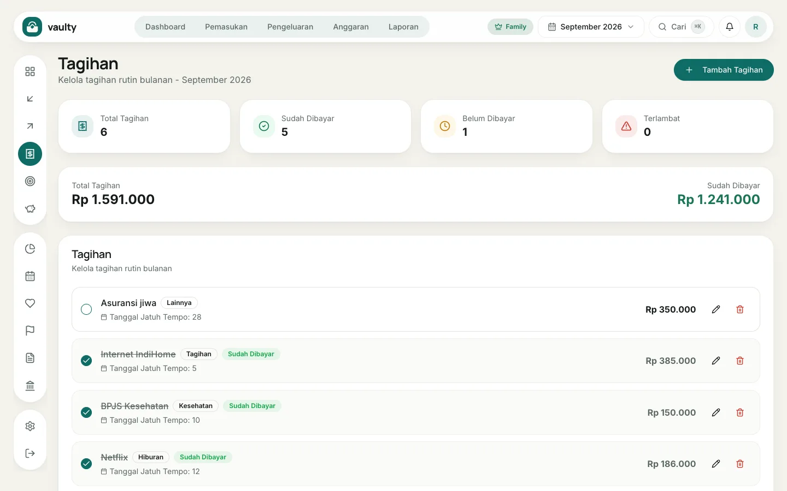
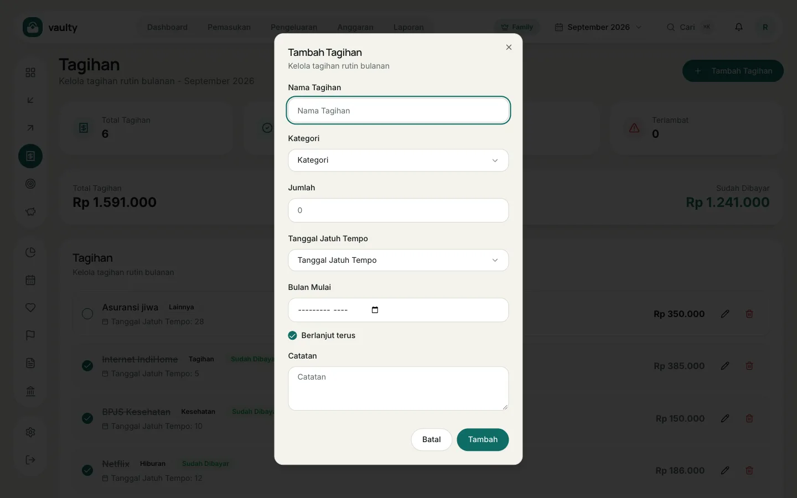

**Tagihan** untuk pengeluaran rutin seperti listrik, internet, dan langganan, supaya tidak ada yang terlewat. Tersedia di paket **Personal** ke atas.

## Menambah tagihan

1. Buka **Tagihan** dan klik **Tambah Tagihan**.
2. Isi **Nama Tagihan**, **Kategori**, dan **Jumlah**.
3. Pilih **Tanggal Jatuh Tempo** (1 sampai 31) dan **Bulan Mulai**.
4. Biarkan **Berlanjut terus** menyala untuk tagihan tanpa tanggal berakhir, atau matikan dan isi bulan berakhir.
5. Klik **Tambah**.

## Menandai lunas

Klik lingkaran di kiri nama tagihan. Tagihan berubah **Sudah Dibayar** (dicoret), dan pembayarannya dicatat sebagai pengeluaran bulan itu.

## Membaca ringkasan

Empat kartu di atas menunjukkan **Total Tagihan**, **Sudah Dibayar**, **Belum Dibayar**, dan **Terlambat**. Tagihan yang lewat jatuh tempo tanpa pembayaran diberi label merah **Terlambat**, dan tagihan yang mendekati jatuh tempo muncul di kartu **Tagihan mendatang** di dashboard.
